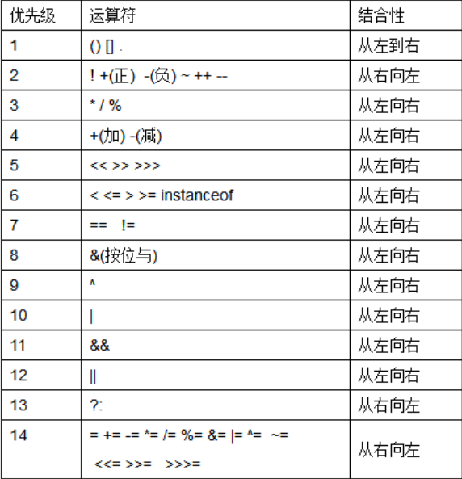
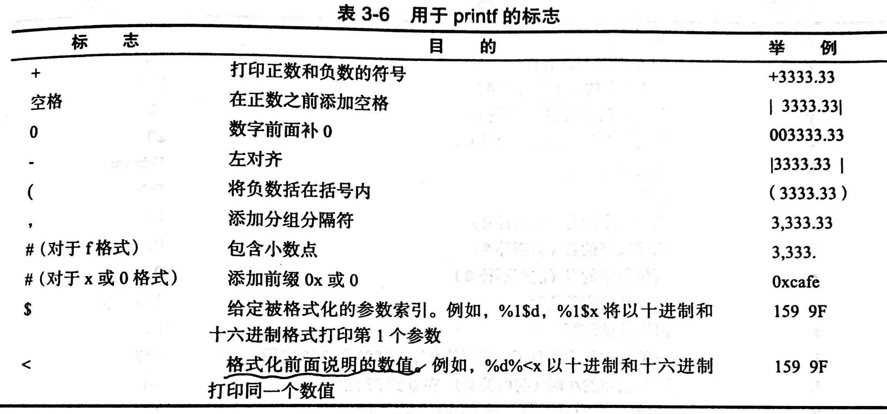
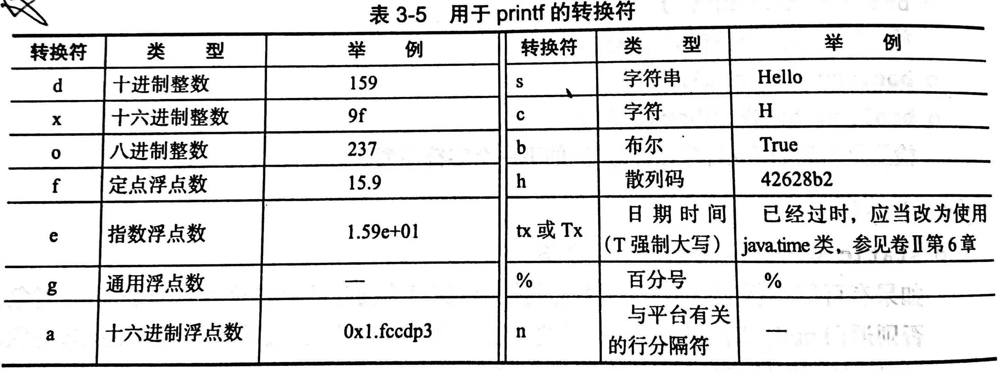
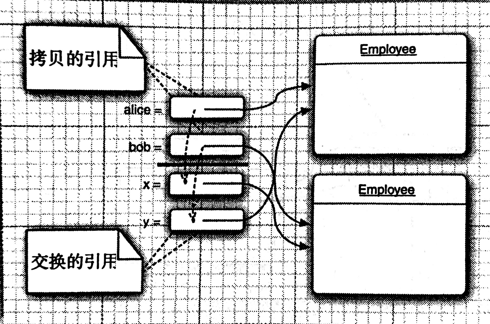
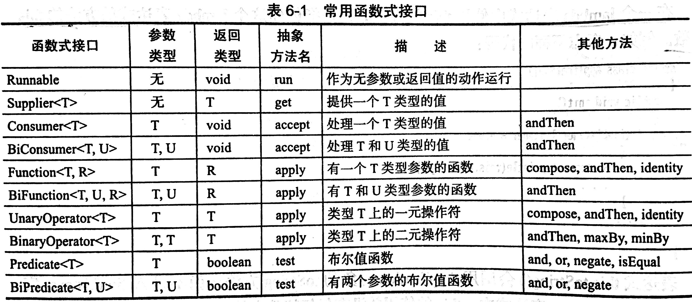

# Java核心技术1

- [Java核心技术1](#java%e6%a0%b8%e5%bf%83%e6%8a%80%e6%9c%af1)
  - [基础程序设计结构](#%e5%9f%ba%e7%a1%80%e7%a8%8b%e5%ba%8f%e8%ae%be%e8%ae%a1%e7%bb%93%e6%9e%84)
    - [基础数据类型](#%e5%9f%ba%e7%a1%80%e6%95%b0%e6%8d%ae%e7%b1%bb%e5%9e%8b)
- [char: java中的字符类型是unicode的一个代码单元,unicode编码可能占据1个代码单元,也可能占据2个, 因此使用char访问是一种过于底层的方法, 通常并不建议, 如果需要访问, 可以按照码点位置访问.`String.codePoints`可以获得字符串的码点位置. 参考资料](#char-java%e4%b8%ad%e7%9a%84%e5%ad%97%e7%ac%a6%e7%b1%bb%e5%9e%8b%e6%98%afunicode%e7%9a%84%e4%b8%80%e4%b8%aa%e4%bb%a3%e7%a0%81%e5%8d%95%e5%85%83unicode%e7%bc%96%e7%a0%81%e5%8f%af%e8%83%bd%e5%8d%a0%e6%8d%ae1%e4%b8%aa%e4%bb%a3%e7%a0%81%e5%8d%95%e5%85%83%e4%b9%9f%e5%8f%af%e8%83%bd%e5%8d%a0%e6%8d%ae2%e4%b8%aa-%e5%9b%a0%e6%ad%a4%e4%bd%bf%e7%94%a8char%e8%ae%bf%e9%97%ae%e6%98%af%e4%b8%80%e7%a7%8d%e8%bf%87%e4%ba%8e%e5%ba%95%e5%b1%82%e7%9a%84%e6%96%b9%e6%b3%95-%e9%80%9a%e5%b8%b8%e5%b9%b6%e4%b8%8d%e5%bb%ba%e8%ae%ae-%e5%a6%82%e6%9e%9c%e9%9c%80%e8%a6%81%e8%ae%bf%e9%97%ae-%e5%8f%af%e4%bb%a5%e6%8c%89%e7%85%a7%e7%a0%81%e7%82%b9%e4%bd%8d%e7%bd%ae%e8%ae%bf%e9%97%aestringcodepoints%e5%8f%af%e4%bb%a5%e8%8e%b7%e5%be%97%e5%ad%97%e7%ac%a6%e4%b8%b2%e7%9a%84%e7%a0%81%e7%82%b9%e4%bd%8d%e7%bd%ae-%e5%8f%82%e8%80%83%e8%b5%84%e6%96%99)
    - [变量](#%e5%8f%98%e9%87%8f)
      - [Tips](#tips)
    - [运算符](#%e8%bf%90%e7%ae%97%e7%ac%a6)
      - [Tips](#tips-1)
    - [字符串](#%e5%ad%97%e7%ac%a6%e4%b8%b2)
      - [Tips](#tips-2)
    - [输入输出](#%e8%be%93%e5%85%a5%e8%be%93%e5%87%ba)
      - [终端的输入输出](#%e7%bb%88%e7%ab%af%e7%9a%84%e8%be%93%e5%85%a5%e8%be%93%e5%87%ba)
      - [文件的输入输出](#%e6%96%87%e4%bb%b6%e7%9a%84%e8%be%93%e5%85%a5%e8%be%93%e5%87%ba)
    - [大数值](#%e5%a4%a7%e6%95%b0%e5%80%bc)
    - [数组](#%e6%95%b0%e7%bb%84)
  - [对象与类](#%e5%af%b9%e8%b1%a1%e4%b8%8e%e7%b1%bb)
    - [使用预定义类](#%e4%bd%bf%e7%94%a8%e9%a2%84%e5%ae%9a%e4%b9%89%e7%b1%bb)
    - [用户自定义类](#%e7%94%a8%e6%88%b7%e8%87%aa%e5%ae%9a%e4%b9%89%e7%b1%bb)
    - [静态域和静态方法](#%e9%9d%99%e6%80%81%e5%9f%9f%e5%92%8c%e9%9d%99%e6%80%81%e6%96%b9%e6%b3%95)
    - [方法参数](#%e6%96%b9%e6%b3%95%e5%8f%82%e6%95%b0)
    - [对象构造](#%e5%af%b9%e8%b1%a1%e6%9e%84%e9%80%a0)
    - [包](#%e5%8c%85)
    - [类路径](#%e7%b1%bb%e8%b7%af%e5%be%84)
    - [文档注释](#%e6%96%87%e6%a1%a3%e6%b3%a8%e9%87%8a)
    - [类设计技巧](#%e7%b1%bb%e8%ae%be%e8%ae%a1%e6%8a%80%e5%b7%a7)
  - [继承](#%e7%bb%a7%e6%89%bf)
    - [类,超类和子类](#%e7%b1%bb%e8%b6%85%e7%b1%bb%e5%92%8c%e5%ad%90%e7%b1%bb)
    - [受保护的访问](#%e5%8f%97%e4%bf%9d%e6%8a%a4%e7%9a%84%e8%ae%bf%e9%97%ae)
    - [Object及其方法](#object%e5%8f%8a%e5%85%b6%e6%96%b9%e6%b3%95)
    - [ArrayList](#arraylist)
    - [参数可变的方法](#%e5%8f%82%e6%95%b0%e5%8f%af%e5%8f%98%e7%9a%84%e6%96%b9%e6%b3%95)
    - [枚举类](#%e6%9e%9a%e4%b8%be%e7%b1%bb)
    - [反射](#%e5%8f%8d%e5%b0%84)
      - [Class类](#class%e7%b1%bb)
      - [Field类](#field%e7%b1%bb)
      - [Method类](#method%e7%b1%bb)
    - [继承的设计技巧](#%e7%bb%a7%e6%89%bf%e7%9a%84%e8%ae%be%e8%ae%a1%e6%8a%80%e5%b7%a7)
  - [接口, lambda表达式和内部类](#%e6%8e%a5%e5%8f%a3-lambda%e8%a1%a8%e8%be%be%e5%bc%8f%e5%92%8c%e5%86%85%e9%83%a8%e7%b1%bb)
    - [接口](#%e6%8e%a5%e5%8f%a3)
    - [lambda表达式](#lambda%e8%a1%a8%e8%be%be%e5%bc%8f)
    - [内部类](#%e5%86%85%e9%83%a8%e7%b1%bb)
      - [局部内部类](#%e5%b1%80%e9%83%a8%e5%86%85%e9%83%a8%e7%b1%bb)
      - [静态内部类](#%e9%9d%99%e6%80%81%e5%86%85%e9%83%a8%e7%b1%bb)
    - [代理](#%e4%bb%a3%e7%90%86)
  - [异常](#%e5%bc%82%e5%b8%b8)

## 基础程序设计结构

---

### 基础数据类型

Java包含8种基础数据类型:

整型类:

- int: 4字节, 大小刚好超过20亿
- short: 2字节
- long: 8字节
- byte: 1字节

使用前缀`0x`表示十六进制; `0`前缀表示八进制, 不推荐; `0b`前缀表示二进制.
浮点数类:

- double: 8字节, 精度小数点后11-15位
- float: 4字节, 精度小数点后5-7位

<<<<<<< HEAD
char: java中的字符类型是unicode的一个代码单元,unicode编码可能占据1个代码单元,也可能占据2个, 因此使用char访问是一种过于底层的方法, 通常并不建议, 如果需要访问, 可以按照码点位置访问.`String.codePoints`可以获得字符串的码点位置. [参考资料](https://www.jianshu.com/p/668356dd8089)
=======
**char**: java中的字符类型是unicode的一个代码单元,unicode编码可能占据1个代码单元,也可能占据2个, 因此使用char访问是一种过于底层的方法, 通常并不建议, 如果需要访问, 可以按照码点位置访问.`String.codePoints`可以获得字符串的码点位置.
>>>>>>> update sword 27-31

**boolean**: 取值true或false

Java没有任何无符号型的整数类型.使用`Double.POSITIVE_INFINITE`表示正无穷, `Double.NEGATIVE_INFINITE`表示负无穷, `Double.NaN`表示非数字, `NaN`不能用等于判断而是用`isNaN`方法判断.

两个数值进行二元操作时, 若其中一个为double, 则都转换为double;若其中一个为float, 则都转换为float; 若其中一个为long, 则都转换为long; 否则都转化为int. 因此两个short数相加的结果为int.

### 变量

Java中基本数据类型不区分c++中声明和定义, 变量的初始化使用

```java
int i = 5;
double d = 5.;
```
**作用域** 方法中的同名局部变量会覆盖类的属性.若要使用该同名的属性, 需加`this.`.
#### Tips

- Java中常量通过`final`修饰, 被修饰的变量的值在初始化时被定义不能再修改, Java把`const`列为关键字但没有使用.
- Java中变量不能够像C++那样进行向boolean的类型转换, 需要显式的调用方法给出boolean变量作为判断条件.
- Java中main方法是static的, void默认在终止程序的时候返回0, 若要返回其他代码, 需调用`System.exit`方法.
- Java中不能在两个嵌套的块中使用相同变量名, 在C++中内层的同名变量会覆盖外层定义的变量, 但Java不允许这样做.

### 运算符

运算符的结合性和优先级

</img>

枚举类型:

和C++中的枚举类型相似, 可以给出有限个元素和索引对应, 语法举例如下:
```java
enum Car{TOYOTA, HONDA, FORD};
Car car1 = Size.TOYOTA;
```

该类型变量只能存储枚举值或null.

#### Tips

- 整数被0除产生一个异常, 浮点数被0除产生一个NaN或无穷大.
- java中提供了`floorMod`方法解决负数取余为负的问题, 但是对除以负数的取余, 结果依然为负
- Math类中提供了一套带Strict前缀的类和方法, 用以解决浮点数的运算精度的问题.具体参考StrictMath类
- 三元操作符对后两个操作数会向精度高的做自动提升, 例如`(false)?new Double(1.0) ? new Integer(2);`返回的是`2.0`.

### 字符串

**不可变字符串:** String类是java中的很重要的类, 内存模型上, String类是不可变的, 即对String的修改实际上是创建了一个新的String对象, 如果要频繁修改String对象的内容, 可以使用StringBuilder类, **对于多线程都可能修改内容的情况, 使用StringBuffer类**.

**拼接:** String类可以使用`+`进行拼接, 这也是Java中符号唯一的重载, 返回的是新创建的两个String类拼接后的新对象. 当一个字符串与一个非字符串拼接时, 后者会转换成字符串.

**判断相等:** 为检测两个字符串是否相等, 不能使用等号, String提供的方法有`String.equal(String other)`方法, 同时也可以使用`String.compareTo(String other)`, 后者和C语言中的`strcpy`表现一致, 相等时返回0, 第一个不相等的字符小于other时返回负数,否则返回正数. 对于大小写不敏感的情况, 可以使用`equalsIgnoreCase`方法.

**空串与null:** 字符串可以为空, 即`String new1 = ""`, 这和`String new2 = null`是不相同的, 前者是String对象, 后者不是, 对后者调用String方法会产生错误, 因此判断时需要先判断是否为`null`再判断`length`是否为0.

#### Tips

- String的`length`方法返回的是代码单元的数量, 当字符串包含2个代码单元的Unicode字符时, 为获得字符数, 需要使用`codePointCount`方法.
- 调用`String.charAt(n)`方法返回的是n位置的代码单元, 要想得到第i个码点, 应当使用
    ```java
    int index = str.offsetByCodePoints(0, i);
    int cp = str.codePointAt(index);
    ```
- **String trim()** 返回一个新字符串, 删除了原始字符串首尾的空格.
- **String substring(int beginIndex) && String substring(int beginIndex, int endIndex)** 返回字符串从beginIndex到endIndex-1的所有代码单元.
- **int indexOf(String str) && int indexOf(String str, int fromIndex) && int indexOf(int cp) && int indexOf(int cp, int fromIndex)** 返回与字符串str或代码点cp匹配的第一个子串的开始位置, 若找不到返回-1.

### 输入输出

#### 终端的输入输出

终端最基本的输出方式是采用`system.out.println()`调用`system.out`对象的`println`方法, 与之相似的是`print`方法(输出不换行). 最基本的从终端输入的方式相比更加复杂一些,

```java
import java.util.* // Scaner位于utils包中
Scanner in = new Scanner(System.in)
String input = in.nextLine()
```

`Scanner`定义在util包, 当使用的类不是定义在基本的lang中时, 需要通过`import`导入.

首先需要用`System.in`对象创建一个Scanner对象, 然后从Scanner对象使用`nextLine`方法读取数据, 相似的方法有`next`读取下一个单词, `nextInt`读取一个整型, `nextDouble`读取一个浮点数. 此外还有`hasNext`, `hasNextInt`, `hasNextDouble`方法用于判断是否存在.

某些终端输出的场景需要采用格式化的输出, 在这种情况下, 可以使用与C语言语法一致的`printf`方法, 控制输出格式, 格式控制符如下:





> String类也给出使用格式化语法构建对象的方法, `String s = String.format(expression, params)`

某些终端输入场景例如输出密码的场景,不能够采用明文的输入方式, Java提供了Console类解决.

```java
Console cons = System.console();
String username = cons.readLine("namne: ");
char[] passwd = cons.readPasswd("Password:");
```

Console对象处理时, 每次只能读入一行, 不能进行更加方便的读取.

#### 文件的输入输出

文件的读取和终端的输入类似, 可以使用`Scaner(filePath, encodingType)`创建一个新的对象, 然后读取, 当path不存在是报错; 文件的写入使用`PrintWriter(filePath)`创建一个新的对象, 当文件不存在时会创建新的文件.

### 大数值

为了解决上下溢出的问题, Java提供了java.math中 `BigInteger`和`BigDecimal`类, 前者可实现任意精度的整数运算, 后者可以实现任意精度的浮点数运算, 由于Java不能够对操作符进行重载, 这两类有自己的运算符,加(.add), 减(.subtract),乘(.multiply), 除(.divide), 取余(.mod). 可以使用`.valueOf(int/double)`将普通数值转换为大数. 

### 数组

Java中的数组使用`int[] a`声明一个变量,但并没有真正初始化一个数组. 定义一个数组对象需要指明大小`int[] a = new int[100]`. 数组的初始化可以采用以下方式:

```java
int[] a = new int[10];
int[] a = {1, 2, 3, 4}; // 这种情形不需要new
new int[] {1, 2, 3, 4} // 初始化一个匿名数组
smallPrime = new int[] {2, 3, 5, 7}; //匿名数组的使用, 可用于不创建新变量情况下重新初始化数组.
```

Java中允许数组的长度为0, 因此可以通过`new elementType[0]`创建数组, 当返回类型为数组但是结果为空时可以使用

**数组遍历:** 对于数组和实现了Iterable接口的对象, 可以使用`for(type: Iterable)`的for each 语句进行遍历.

**数组拷贝:** 数组存在深拷贝和浅拷贝的问题, Java中默认使用的是引用赋值的方式, 因此直接赋值其实是传递地址, 两个数组对象指向相同内存. 若要深拷贝, 可以使用`Arrays.copyOf(Array, int length)`方法.

**命令行参数:** Java的main函数总是带着`String[] args`的参数, 用以获取命令行参数, 与C++不同的是, java的`args`不包含执行命令, 即`args[0]`直接是后面跟的参数.

**多维数组:** Java中的没有多维数组的概念, 实质上是数组的数组, 外层数组的元素其实是数组指针, 因此数组元素与数组元素之间的长度不一定需要相等, 即可以用`type[num][] a`定义一个多维数组, 再依次创建type[n]的对象, 这一点和C++是有所不同, 但是和C++里指针数组又是一致的.

Java的二维数组变量的[]位置无关, 以下几种声明都是对的

```java
float[][] a;
float []a[];
float a[][];
```

打印数组的内容可以使用`Arrays.toString`方法, 对于多维数组, 可以使用`Arrays.deepToString`方法.

## 对象与类

---
类是产生对象的模板, 是Java语言的基石. 类是对事物的抽象,  类包含实例域, 静态域, 方法等部分, 实例域是类的数据, 方法是操纵数据的手段. 对象是类的实例. 实现封装的关键是不能让类中的方法直接访问其他类中的实例域. 面向对象的程序设计是以数据而非过程为中心的设计方式, 经验上来说是一个找名词找动词的过程.

对象要素:

- 对象的行为
- 对象的状态
- 对象标识

对象状态的改变必须调用对象的方法实现.

类之间的关系:

- 依赖关系(use-a)
- 包含关系(has-a)
- 继承关系(is-a)

### 使用预定义类

java中预定义了大量类可以用以创建对象, 对象是承载数据的实体, 对象变量不包含对象, 它只引用对象, 例如`LocalDate date`声明(创建)了一个对象变量但它不具有对象, 创建对象使用`new Class(params)`进行, 创建的对象可以直接用于方法, 也可以通过对象变量引用.  可以显式的将对象变量设置为`null`表示当前变量没有引用任何对象. **所有Java对象都存储在堆中.** 

对于对象操作的方法, 有的会改变对象的状态, 有的并不会改变,  例如`String`类对象的`subString()`方法, 返回的是一个新构建的对象, 而不会改变对象本身, 这种称为*访问器方法*; 有的方法则需要修改对象的状态. 根据是否对对象的状态进行修改, 可以将方法分为更改器方法和访问器方法.

> 注意不要编写返回引用可变对象的访问器方法. 其他类可以调用该对象的方法直接修改了本类的实例域. 例如返回`Date`类的实例域对象.

### 用户自定义类

用户自定义类使用和类相同的名称命名源文件. 在一个源文件中, 只能有一个公有类, 和任意数目的公有类. 对于多源文件的工程, 可以使用`javac file1.java file2.java ..`编译, 也可以只显式的编译含有需要运行`main`方法的类,编译器能够自动的查找到依赖的对应的源文件, 相当于c++中的make工具.

**构造器**

- 构造器域类同名
- 每个类可以有一个以上的构造器
- 构造器可以有0到多个参数
- 构造器总是伴随着`new`操作一起调用.

类方法的参数具有两个部分, 对象会作为隐式参数传入, 可以用`this`调用, 其他参数会通过函数的形参传入.
Java中所有方法都在类内定义, 是否内联由编译器决定.
类方法能够访问同类的任何一个对象的私有域. `public`修饰的方法可以被任何类访问, `private`修饰的方法仅可在类内访问. 类具有相似的访问权限, 不带修饰的类, 可以被同一个包的其他类访问.

**final实例域** 类中用`final`修饰的实例域在定义时进行初始化, 此后不能修改值. final修饰符大多应该应用于基本类型域或不可变类的域.(类中的方法都不能改变其对象, 如String)`final`仅限制了该变量只能够引用该对象不能够再引用别的对象, 但外部依然可以调用该对象的方法修改对象的状态.

### 静态域和静态方法

**静态域** 声明了`static`的类域, 不属于任何对象, 能够通过类名进行访问, 在类第一次被加载时执行初始化.

**静态常量** 声明了`final`的静态域, 这类域在声明时就进行初始化, 此后不能在更改, 常见的`Math.pi`就属于这一类. 静态常量可以声明为`public`, 因为它们通常不能再被修改.

> System类中的out是公有静态常量, 但是有一个`setOut`方法, 可以修改out为不同的流, 这个方法是一个本地方法不是用java语言实现.

**静态方法** 声明了`static`的方法, 这类方法不带有隐式参数, 可以通过类名或类的对象(不推荐)调用, 不需要创建对象就可以使用.

用静态方法的情况:

- 需要访问类的静态域
- 不需要访问对象的状态, 其所需要参数都通过显式参数提供.

**工厂方法** 工厂方法是一类用于产生对象的静态方法, 不用构造器而用工厂方法构造对象的原因是

1. 无法命名构造器. 构造器名只有一个, 但希望得到的实例使用不同的类名
2. 使用构造器时, 无法改变所构造的对象类型. 例如需要返回子类对象

**main方法** main方法是一种静态方法, 是程序的入口, 每个类可以有一个main方法, 也可以没有, 主力类源文件中通常使用main方法进行一些单元测试等.

### 方法参数

Java中的参数传递仅有值传递形式, 而不具有C++中的引用传递方式. 直观上理解, 形参创建了同类型的变量后, 引用了域实参相同的对象, 可以通过形参调用对象的方法改变该对象的状态, 但是不能够通过改变形参引用的对象来修改外部实参指向的对象. 即C++中常用的`swap(type &a, type &b)`在java中是无法实现的, 可以通过包装类的方式或其他方式进行交换.[参考资料](https://blog.csdn.net/bntx2jsqfehy7/article/details/83508006)



方法中的参数使用情况总结:

- 一个方法不能修改一个基本数据类型的参数
- 一个方法可以改变一个对象参数的状态
- 一个方法不能让独享参数引用一个新的对象

### 对象构造

**重载** 多个方法, 具有相同的方法名和不同的参数列表称为重载.

**默认域初始化** 如果一个域在创建时没有赋值, 编译器会对他进行默认初始化, 数值型变量为0, 布尔变量为false, 其他变量为null.

**默认构造器**  如果一个类没有构造器, 编译器会给它创建一个无参数的构造器, 构造器将所有实例设置为默认值. (如果域声明显式赋值, 则按赋值) 但是对于至少具有一个构造器的方法, 编译器不再创建默认构造器, 此时如果需要, 需要自己定义不带参数的构造器.

**显式域初始化** 显式初始化包括两种方法, 一种是在声明时对域赋值, 初始值不一定是常量, 也可以调用方法对域进行初始化; 另一种是在构造器中对域进行赋值. 显式初始化是一种良好的程序设计.

**初始化块** 除了直接对域赋值, 也可以直接在类内添加`{ }`包围起的代码块称为初始化块, 在每次创建对象时, 该部分都会被首先调用. 同时 ,可以在块前声明`static`构建静态初始化块, 可以用于对静态域进行更加复杂的初始化操作, 该块在该类第一次被加载时被调用.

**调用另一个构造器**  可以在一个构造器的第一行使用`this(params)`调用另一个构造器, 其作用和C++中的初始列表中调用其他构造器的作用一致, 但是相比C++, java的类中不包含对象, 只包含对象指针, 因此不存在C++中构造前必须先调初始化列表的尴尬问题.

调用构造器步骤:

- 所有实例域初始化为0, false或null
- 按照在类声明中出现的顺序,依次执行所有域的初始化语句和初始化块
- 如果构造器的第一个行调用了第二个构造器, 执行第二个构造器的主体
- 执行构造器的主体

**finalize方法** 申明了finalize的方法会在对象被析构时调用, 但是不能够以来该方法,因为不能够确定对象何时被析构.

### 包

**类的导入** 一个类可以使用所属包内的所有类和其他包中的公有类. 可以使用包的全名访问其他包公有类 , 也可以使用`import`导入类.

- 可以通过`*`一次导入一个包, 但是不能一条语句同时导入一个包下的多个包.
- 引入的两个包中有同名的类, 为了确定使用的是哪个包中的这个类, 可以单独声明一下导入这个类.
- 如果两个类都要使用, 需要指明包名.

与类相似的, 类的静态方法和静态域也可以通过`import`导入.

为了将自己的类放入包中, 可以在源文件的第一行使用`package com.corejava.ch04;`的方法申明所在包名, 源文件的位置需要放在与包名一致的树状目录的基目录, 这里就是`/com/corejava/ch04/`, 而进行编译和虚拟机调用类时, 都应该在根目录进行. 如果没有在源文件中放置package语句, 源文件会被放入一个无名的默认包. 如果源文件不在对应的子目录下, 若其没有外部依赖可以正常编译, 但虚拟机找不到类, 不能正常运行.

**包作用域** 正如之前所说, 一个没有用访问权限修饰符修饰的类可以被所在包的所有方法使用

### 类路径

类路径即`CLASSPATH`, 是编译器和虚拟机查找类的依据, 类路径中所列出的目录和归档文件是搜索类的起点, 当没有指定类所在的包时, 编译器在类路径列出的位置开始搜索依赖的类, 若找到一个以上的类则会报错. 若自己通过`java -cp`设置类路径时, 如果没有设置当前路径, 虚拟机也不会在当前路径查看类. 类路径中放置的应当是包的根目录和jar包所在位置和当前位置.

### 文档注释

### 类设计技巧

- 数据必须私有化: 数据私有化是OOP的基础, 能够有效保护数据
- 数据都需要合适的初始化: 不要依赖默认初始化, 最好能够显式的进行初始化
- 尽量不要在类中使用过多的基本数据类型: 当存在过多的基本数据类型时, 应当用其他类代替, 进行进一步的抽象
- 不是所有域都需要独立的访问器和修改器
- 拆分职责过多的类
- 类名应和方法名应域它的职责一致
- 优先使用不可变类: 多线程友好

## 继承

---
### 类,超类和子类

超类, 子类和类的关系, 超类是类的父类, 类是子类的父类, 三者是继承关系, 可以通过`extends superClass`继承超类. java中的继承机制是单继承. 继承可以获得父类的域和方法, 但是类并不能够直接访问父类的私有域, 要借用父类的私有域的访问器方法和修改器方法对这部分域进行使用. 


继承后可以对父类的方法进行覆盖, 覆盖要求两者方法的签名完全一样, 此时依然可以通过`super.method`调用父类的方法.

`super`除了在父类方法调用中会被使用, 还可以在构造器中通过`super(parms)`调用父类的构造器, 和this一样要求在第一行. 如果没有显式的调用父类构造器, 则将会自动调用父类的默认构造器.

> super 和c++中的this概念不同, 它不是对象的引用, 不能够赋给另一个对象变量.`super.getSalary`相当于c++中的`Employee::getSalary`.

在实现继承时, 覆盖方法时, 签名必须完全相同, 但是返回类型可以是原方法返回类的子类.

可以使用`@override`标记重写的方法, 要求编译器进行类型检查.

**多态**: 超类变量可以引用超类, 也可以引用超类的子类, 它们对于超类变量来说是等价的, 但是在真正调用对象的方法时, 会根据对象的实际类型, 调用该类的方法(即可能是覆盖了超类的方法), 一个对象变量可以指向多种实际类型的象的现象称为*多态*.

**动态绑定:** 虚拟机在运行过程中能自动的选择调用哪个方法的现象

**静态绑定:** static方法, private方法, final方法和构造器在编译时就能够确定其调用的方法的现象.

继承层次: 由一个公共类派生出的所有类的集合成为继承的层次.

**方法调用的过程**
- 确定对象的声明类型和方法名, 列出当前类中该命名的方法和超类中声明为`public`的该名称方法.
- 检查调用方法时提供的参数类型, 如果有一个与提供的类型完全匹配就选择. 这称为*重载解析*.如果可以找到多个或找不到都会报错
- 如果方法是静态绑定的, 那就直接确定了.
- 如果方法是动态绑定的, 那么虚拟机会调用与变量所引用的类型最匹配的类的方法. 虚拟机用方法表记录每个类型的方法


**阻止继承**: 声明了`final`的类不能够被继承, 声明了`final`的方法在被继承时不可以被覆盖, 子类依然可以调用被`final`修饰的方法. 如果把一个类设为final, 类方法自动变为`final`而不包括域.

**强制转换**: 强制转换的前提是可以转换, 例如当对象本来是`class1`, 处理过程中将其转化成`Object`, 可以通过`(class1)`对其进行强制类型转换. 不能够将`Object`对象直接转化为子类对象.这一问题在数组操作中存在, 下面举一例.

> 进行类型转换的唯一原因是在忽略对象的实际类型之后, 使用对象的全部功能. 强制转换只能在继承层次间进行, 将超类转换成子类之前需要用`isInstanceOf`关键字进行检查.

```java
Employee[] es = new Manager[5];
es[0] = new Employee(); // 会报错, 数组会记录自己的实际类型, 并监督放入的引用都是可兼容的类型. 
//这样的操作缺少了Manager的实例域.
```

**抽象类**: 方法可以在访问表示符后通过申明`abstract`变为一个抽象方法, 含有一个以上抽象方法的类, 称为抽象类, 类也可以直接声明为抽象类, 抽象方法不需要实现, 抽象类不能够实例化, 但是可以声明这个类型的变量. 

- 抽象类是代码抽象的重要机制, 子类中的公共方法应当在抽象类中实现, 抽象类不应该实现方法的思想是错误的.
- 扩展抽象类的两种方法, 实现全部抽象方法, 子类就不是抽象的; 实现部分抽象方法, 子类也是抽象的.
- 类即使不含抽象方法, 也可以将类声明为抽象类.

### 受保护的访问

访问控制符声明为`protect`的成员可以被同一包或者子类访问, 默认访问控制符的成员可以被同一个包访问.

更详细的说, protected的规则如下:
- 包内可见,并对子类可见.
- 若子类和父类不在同一个包, 子类中子类实例可以访问从父类继承来的protected方法, 而不能访问父类实例的protected方法

> 引申: 若和父类不在同一个包中, 子类不能访问其他子类的父类protected方法. 也就是p227说的, 子类只能调用受保护的clone方法来克隆自己的对象的由来. 

举例:
```java
//Duck1.java
package playground;

public class Duck1 {
    public static void main(String[] args) {
        Duck1 d = new Duck1();
        d.testSelfClone();
        d.testOtherSubclassClone();
        d.testOtherSubclassWithPublicClone();
    }
    public void testSelfClone() {
        clone(); // 可以, 从父类继承来的
    }
    public void testOtherSubclassClone() {
        Duck2  d2 = new Duck2();
        d2.clone(); // 是要报错的, 不能在子类中调用其他子类的父类protected方法.
    }
    public void testOtherSubclassWithPublicClone() {
        Duck3 d3 = new Duck3();
        d3.clone(); // 可以, 该类开放了public
    }
}

//Duck2.java
package playground;

public class Duck2 { }

//Duck3.java
package playground;

public class Duck3 {
    public Duck3 clone() throws CloneNotSupportedException {
        return (Duck3) super.clone();
    }
}
```

但是如果子类和父类在同一个包中, 事情又不一样了. 因为在同一个包中, 父类的protected方法是可见的.因此, 子类可以访问别的子类的父类protected方法.
```java
//Bird.java
package playground;

public class Bird {
    protected void pFunc() {
        System.out.println("IN Bird.pFunc.");
    }
}
//Duck1.java
package playground;

public class Duck1 extends Bird{
    public static void main(String[] args) {
        Duck1 d = new Duck1();
        d.testSelfpFunc();
        d.testOtherSubclasspFunc();
        d.testOtherSubclassWithPublicpFunc();
    }
    public void testSelfpFunc() {
        pFunc(); // 可以, 从父类继承来的
    }
    public void testOtherSubclasspFunc() {
        Duck2  d2 = new Duck2();
        d2.pFunc(); // 可以, 因为在同一个包
    }
    public void testOtherSubclassWithPublicpFunc() {
        Duck3 d3 = new Duck3();
        d3.pFunc();
    }
}

//Duck2.java
package playground;
public class Duck2 extends Bird{ }
//Duck3.java
package playground;
public class Duck3 extends Bird { }
```


### Object及其方法

Object类是所有类的父类, 该类具有大量的方法能够供类使用, 其中有几种方法在实现时可能需要重载, 需要被重点记录.

> 只有基本类型不是Object的子类, 包括int, float, char, boolean. 所有数组类型不管是对象数组还是基本类型数组都扩展了Object类.

`equals`方法: 继承中该方法存在以下的问题: 如果子类能够拥有相等的概念, 则覆盖该方法时应该采用`getClass`方法; 如果由超类决定相等的概念, 那么就可以使用`instanceof`进行检测, 这样可以在不同的子类之间进行相等的比较.

具体的重写流程:
- 显式参数使用Object, 命名为otherObject, 稍后可能会进行转换
- 检测是否是同一对象
- 第一步判断null
- 第二步, 判断是否是同一类, 判断类时, 如果时前一种情况, 可以使用`isinstance`关键字进行判断; 如果是第二种情况, 应该用`.class`属性和`getClass()`判断.
- 如果前面的都相同, 对各个实例的对象域使用`equals`进行判断, 基本类型域用`==`进行判断. 数组类型可以使用`Arrays.equals`方法进行判断.

`hashCode`方法用于对该类实例进行hash时调用, 如果重写了`equals`就必须重写该方法, 保证`equals`相等的两个对象具有相同的`hashcode`. 编写`hashCode`方法时, 对于实例域的哈希可以调用它自己的`hashCode`, 更好的方法是使用`Object.hashCode`方法避免null引起的问题.

还有更好的办法, 可以调用`Object.hash`提供所有实例域作为参数, 该方法会调用各个实例域的`Object.hashCode`并将它们组合起来.

`toString`方法, 在调用print时会调用该对象的`toString`方法. 该方法的注意点是, 对于数组对象, 直接使用会输出奇奇怪怪的东西, 正确的方法是对Array对象使用`Arrays.toString`方法.

> 使用`equals`做比较时, 可能需要考虑对比的两个对象有null的情况, 这时应该使用`Object.equals`方法, 当两者均为null时, 返回`true`.

### ArrayList

**访问列表元素:** 使用`get`方法访问元素, `set`修改元素, `Add`添加元素. `set`只能修改已有的元素不能增加.

**构建列表:** 新的列表都应该使用泛型类型, 而不应该使用Object类型的.

ArrayList类中提供`ensureCapacity`方法, 如果使用`new ArrayList<>(100)`实例化一个对象的话, 该对象具有容纳100个元素的潜力, 但此时内部数组的大小还很小, 增加元素过程中需要重新申请内部数组然后复制过去. `ArrayList.ensureCapacity`方法则在一开始申请一个给定大小的内部数组, 在内部元素达到给定大小之前不用再重新申请空间. 两者的共同点是, 无论是初始化是给大小还是`ensureCapacity`方法给大小, `ArrayList`里在调用`Add`之前都是么有元素的. 


**ArrayList转换为Array:**
```java
X[] a = new X[list.size()];
list.toArray(a); // toArray方法要传入一个创建好的数组.
```
### 参数可变的方法

使用`Class...`作为方法的参数时, 能够接受变数量的参数, 其实相当于接受了一个`Class[]`的数组. 例如`main`可以写成`public static void main(String... args)`.

### 枚举类

在之前就看过, 枚举类型可以写成以下形式:
```java
public enum Size {SMALL, MEDIUM, LARGE, EXTRA_LARGE}; // 注意最后这个;
```
这样就可以定义一个`Size`类, 该类只具有4个实例, 新定义该类的变量时, 直接引用该类的对象, 而不能新建对象(事实上, `enum`类的构造器是`private`的).

所有的enum和class是相似的, 事实上`enum`类型的类都继承于`Enum`类, 该类定义了几个实用方法, 同时可以在上文的基础上对类进行修改.

`toString`方法: 该方法对`enum`对象转化为`String`对象, 默认是原对象名

`Enum.ValueOf(Class, String)`静态方法: 该方法是`toString`的逆方法, 从字符串返回对应的对象.

`values()`方法: 返回所有枚举对象.

可以对构造器进行重载, 也可以增加方法. 能够重载的方法只有`toString`方法.

```java
public enum Size {
  SMALL("small"), MEDIUM("medium"), LARGE("large"), EXTRA_LARGE("extra_large"); //注意这个分号不能少
  private String describe; 
  private Size(String s) {
    describe = s;
  }
  public String getDescribe() {
    return describe;
  }
}
```

### 反射

反射是java运行时分析的重要手段, 能够获得对象的类信息(包括类型, 方法, 域, 域值等).

反射的作用:
- 运行时分析类的能力
- 运行时查看对象, 例如编写适用于所有类型的函数
- 实现通用的数组操作代码.
- 适用Method类, 类似于函数指针

#### Class类

每个类本身是一个Class类, 该类维护了类的类名, 访问控制符, 域, 方法等实例域. 获得`Class`的方法有三种
- 对类直接取属性`Employee.class`
- 对对象获得其类型 `employee.getClass()`
- `Class.forName(String)` 在所有存储的类中查找类, 不论该类是否被该程序使用.

一个`Class`对象具有`getName`获得类名, `getModifiers`获得访问标识符, `getComponentType`获得元素类型(针对Array, 放在Class中有些奇怪)等方法.

`Class`对象具有的域都是`Field`类的实例, 可以通过`getField(String name)`--获得该名称的域, `getDeclaredFields()`--获得所有声明的域, `getFields()`--获得所有public的域

`Class`对象具有的方法都是`Method`类的实例, 和`Field`类似具有几个get方法, 但是需要注意, 因为同名的方法可能不止一个, 因此需要使用方法的签名作为参数, `getMethod(String name, Class<?>... Parameters)`.

>`forName`方法可能会引起已检查异常, 需要和`try`语句一起使用.
#### Field类

`Field`类的实例首先有名字, 可以通过`getName()`获得, 类可以通过`getType()`获得, 返回的是一个`Class`类对象,  重要的是, 现在得到的仅是类的一个域, 要获得这个域的值可以通过一系列get方法

- `get(Object obj) -> Object` 传入的是Class的实例,这个实例具有这个Field, 可以通过get得到
- `getInt(Object obj) -> int`
- `getDouble(Object obj) -> double`
- `getGenericType(Object obj) -> Type` 获得Field对应类型的对象.

但是直接获得, 只能够访问该类public的域, 为了访问到私有域需要首先设置`Accessible`. Field自己就具有`setAccessible(boolean)`, 其实也可以采用`AccessibleObject.setAccessible(Field[] array, boolean flag)`的方法批量的设置.

#### Method类

`Method`类中, 很多方法和之前大同小异, 而最关心的问题是,java中方法是否能够像c++中的函数指针一样被调用, `Method`中具有`invoke(Obj param1, Obj param2)`方法, 将参数传入可以得到返回Object的调用结果. 但是这种方式的运行速度较慢,并不主张使用.

### 继承的设计技巧

- 将公共的方法和域放在超类
- 不要使用受保护的域
- 使用继承实现`is-a`关系
- 除非所有方法都有意义否则不应使用继承
- 覆盖方法时不应改变其行为预期
- 占位
- 不要过多使用反射

## 接口, lambda表达式和内部类

---

### 接口

**概念:** 不是类, 而是对一种需求的描述, 提供了一种标准,供服务端和客户端进行协调.

**特性:**

- 所有方法都是`public`, 所有域都是`public static final`
- 不能有实例域
- 不能使用`new`创建对象
- 可以创建变量, 引用实现了接口的类的对象
- 可以使用`instanceof` 关键字判断一个对象是否实现了接口

Java8之后可以在接口中添加**静态方法**, 代替原本需要工具类来完成的工作, 静态方法在接口中起到实用工具的作用.

**默认方法**: 对方法申明`default`可以将方法声明为默认方法, 默认方法使得实现该接口的类只需要实现自己需要重写的方法, 而不用重写所有方法. 例如`Collection`接口中的`isEmpty()`方法就可以用默认方法实现.

默认方法产生冲突的情况:
- 继承的超类和实现的接口有相同签名的方法
- 实现的多个接口中有相同签名的默认方法

解决方法:
- 超类优先
- 多个接口的相同签名默认方法冲突时, 由实现类实现该方法来决定使用哪个默认方法. 多个接口的相同签名方法有至少一个声明成了默认方法, 就需要解决这种一致性的冲突.


**接口与抽象类对比:** 

- 抽象类可以实现普通方法, 抽象类可以有实例域, 接口不可以
- 抽象类是类, 接口不是
- 抽象类只能单继承, 接口可以实现多个, 达到多继承的目标
- 抽象类和接口都可以被其他抽象类/接口继承
- 抽象类和接口都可以用`instanceof`判断

接口能够避免多继承的复杂情况, 同时基本实现多继承的功能


### lambda表达式

lambda表达式的作用, 传递代码块, 一次或多次使用.

**语法:** lambda表达式的基本形式为`(Class param)->{sentence;}`, 需要注意的语法点包括:
- 不需要显式指定返回类型, 可以推导
- 当参数类型可以推导时, 也可以不指定参数类型, 例如`Comparator<String> com = (first, second)-> first.length() - second.length();`
- 当只有一句语句时, 花括号可以不用, 也不用加分号
- 小括号必须有, 即使没有参数时也需要有个空括号
- 返回类型可以为void, 在语句中没有返回值

**函数式接口**: 只有一个抽象方法的接口称为函数式接口, 例如`Comparator`, `ActionListener`都是函数式接口, 在需要函数式接口变量的参数位置, 可以使用lambda表达式进行替换. 注意只有一个抽象方法的接口与只有一个方法的接口不同, 只有一个方法的接口完全可以声明一个`Object`的方法. Java提供了很多有用的抽象函数接口可供使用, 例如断言等接口.

**方法引用**:方法引用可以将现成的方法转化为lambda表达式再转为函数式接口的实现类对象. 当希望用lambda表达式实现的动作已经有现成的方法实现时, 可以用方法引用代替.
```java
Timer t = new Timer(100, event->System.out.println(event)); // 可以用以下方法引用代替
Timer t = new Timer(100, System.out::println);
```
方法引用有以下几种形式:
- object::instanceMethod
- Class::staticMethod
- Class::instanceMethod

其中需要理解一下的是第三个, 当调用实例方法时, 第一个参数作为方法的对象, 即`(x, y)->x.instanceMethod(y)`

**构造器引用**: 构造器引用和方法引用类似, 只不过这里的方法名是`new`, 即 `Class::new`相当于`(x)->return new Class(x)`.

**lambda表达式中的变量作用域**: lambda可以引用外部的变量, 但是只能使用外部的不可变对象, 并且其作用域和外部是一致的, 即lambda表达式中用的变量不能和外部变量重名. lambda表达式转化的对象会隐式的保存引用的外部对象, 作用相当于**闭包**.

**编写函数接收lambda表达式**: 在需要接受lambda表达式的参数位置, 设置合适的函数式接口的变量就可以接受lambda表达式. Java提供了一系列实用函数式接口.



**Comparator的实用静态方法:**

**comparing方法**

Comparator提供了一个更加实用的比较器构造器函数`Comparator.comparing`, 这个方法的参数可以是方法引用或lambda表达式, 用于获取对象的键. 例如:
```java
Arrays.sort(people, Comparator.comparing(Person::getName()));
// 按照名字对people中的person进行排序
```
**thenCompare方法**

该方法可以与`thenCompare`方法串联起来传入多个获取键的方法引用或lambda表达式, 当前者相等时,按照后面的键继续比较.
```java
Arrays.sort(people, Comparator.comparing(Person::getName()).thenCompare(Person.getAge()));
```

**Comparing, thenCompare方法变体**
- 为了避免自动装箱, 可以使用`ComparingInt`和`thenCompareInt`等变体
- 当获取键的方法可能获得null时, 需要指定这样的对象怎么排序, java提供了`Comparator.nullsFirst, Comparator.nullsLast`的适配器. 用法如下:
  ```java
  comparing(Person::getName(), Comparator.nullsFirst())
  ```

### 内部类

定义在另一个类中的类

**特性**:
- 可以访问该类定义所在作用域的数据, 包括私有数据
- 可对包中的其他类隐藏
- 当定义回调函数时, 可以很方便的使用匿名内部类.
- Java的内部类包含一个隐式引用, 指向实例化该内部对象的外部对象.[编译器修改内部类构造函数增加引用]
- 虽然定义在外部类当中, 但是并不表示外部类包含内部类的实例这样一个数据成员, 它的实例化依然是通过某个方法中对该类的对象的构造.
- 内部类可以定义成私有的, 而常规类只有包可见性和公开可见性.

**语法**:

在内部类中访问外部类中的变量, 更加明确的指定写法: `outClass.this`

在外部显式的调用内部类的构造器: `outClass.innerClass obj = outObject.new innerClass(params)`

**有用?必要?安全?**

- 内部类的作用是更高的访问权限, 可以访问外部类的私有方法和数据成员
- 内部类的是编译器现象, 虚拟机层面没有内部类的概念, 内部类将被编译成特殊的普通类
- 内部类的实现是在内部类中增加`this$000`之类的特殊标识符的数据成员, 并在外部类中增加一个`access$000(obj)`的静态方法来实现. 包含`$`在Java中不是一个外部合法的标识符.
- 事实上可以通过某一些方法对上述的特殊成员变量和静态方法进行调用(通过十六进制编辑器修改标识符名)

#### 局部内部类

语法: 在某个代码块中, 例如成员方法中包含一个内部类

变量作用域: 局部内部类可以访问外部类的数据成员, 可以访问方法中的局部变量. 这种访问的实现通过编译器在局部内部类中添加带`$`特殊符号的数据成员, 保存局部变量. 局部内部类所引用的局部变量必须是**事实上final**的. 在Java8之前, 必须是final的.

访问控制: 局部内部类不能声明成`public`或`private`, 其只对当前代码块可见, 对外其他成员方法都不可见. 

用途: 回调函数?

#### 静态内部类

语法:

变量作用域:

访问控制:

用途:

### 代理

## 异常

finally总结
- 不管有木有出现异常，finally块中代码都会执行；
- 当try和catch中有return时，finally仍然会执行；
- finally是在return后面的表达式运算后执行的（此时并没有返回运算后的值，而是先把要返回的值保存起来，管finally中的代码怎么样，返回的值都不会改变，任然是之前保存的值），所以函数返回值是在finally执行前确定的；
- finally中最好不要包含return，否则程序会提前退出，返回值不是try或catch中保存的返回值。


