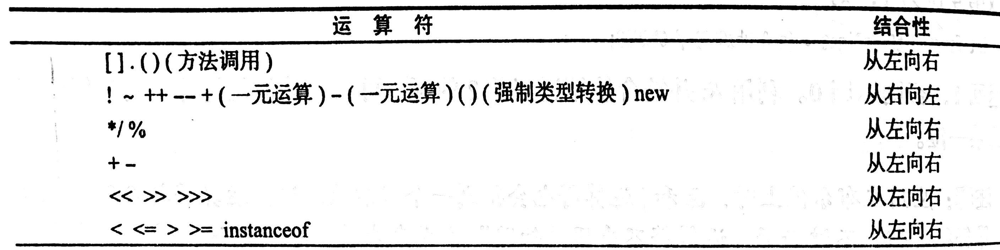
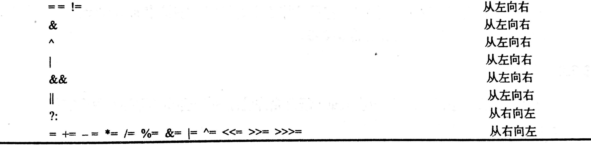

# Java核心技术1

- [基础程序设计结构](#基础程序设计结构)
  - [基础数据类型](#基础数据类型)
  - [变量](#变量)
  - [运算符](#运算符)
  - [字符串](#字符串)
  - [输入输出](#输入输出)
  - [大数值](#大数值)
  - [数组](#数组)
- [对象与类](#对象与类)
  - [使用预定义类](#使用预定义类)
  - [用户自定义类](#用户自定义类)
  - [静态域和静态方法](#静态域和静态方法)
  - [方法参数](#方法参数)
  - [对象构造](#对象构造)
  - [包](#包)
  - [类路径](#类路径)
  - [文档注释](#文档注释)
  - [类设计技巧](#类设计技巧)
- [继承](#继承)

## 基础程序设计结构

---

### 基础数据类型

Java包含8种基础数据类型:

整型类:

- int: 4字节, 大小刚好超过20亿
- short: 2字节
- long: 8字节
- byte: 1字节

使用前缀`0x`表示十六进制; `0`前缀表示八进制, 不推荐; `0b`前缀表示二进制.
浮点数类:

- double: 8字节, 精度小数点后11-15位
- float: 4字节, 精度小数点后5-7位

char: java中的字符类型是unicode的一个代码单元,unicode编码可能占据1个代码单元,也可能占据2个, 因此使用char访问是一种过于底层的方法, 通常并不建议, 如果需要访问, 可以按照码点位置访问.`String.codePoints`可以获得字符串的码点位置.

boolean类: 取值true或false

Java没有任何无符号型的整数类型.使用`Double.POSITIVE_INFINITE`表示正无穷, `Double.NEGATIVE_INFINITE`表示负无穷, `Double.NaN`表示非数字, `NaN`不能用等于判断而是用`isNaN`方法判断.

两个数值进行二元操作时, 若其中一个为double, 则都转换为double;若其中一个为float, 则都转换为float; 若其中一个为long, 则都转换为long; 否则都转化为int. 因此两个short数相加的结果为int.

### 变量

Java中基本数据类型不区分c++中声明和定义, 变量的初始化使用

```java
int i = 5;
double d = 5.;
```
**作用域** 方法中的同名局部变量会覆盖类的属性.若要使用该同名的属性, 需加`this.`.
#### Tips

- Java中常量通过`final`修饰, 被修饰的变量的值在初始化时被定义不能再修改, Java把`const`列为关键字但没有使用.
- Java中变量不能够像C++那样进行向boolean的类型转换, 需要显式的调用方法给出boolean变量作为判断条件.
- Java中main方法是static的, void默认在终止程序的时候返回0, 若要返回其他代码, 需调用`System.exit`方法.
- Java中不能在两个嵌套的块中使用相同变量名, 在C++中内层的同名变量会覆盖外层定义的变量, 但Java不允许这样做.

### 运算符

运算符的结合性和优先级

</img>
</img>

枚举类型:

和C++中的枚举类型相似, 可以给出有限个元素和索引对应, 语法举例如下:
```java
enum Car{TOYOTA, HONDA, FORD};
Car car1 = Size.TOYOTA;
```

该类型变量只能存储枚举值或null.

#### Tips

- 整数被0除产生一个异常, 浮点数被0除产生一个NaN或无穷大.
- java中提供了`floorMod`方法解决负数取余为负的问题, 但是对除以负数的取余, 结果依然为负
- Math类中提供了一套带Strict前缀的类和方法, 用以解决浮点数的运算精度的问题.具体参考StrictMath类

### 字符串

**不可变字符串:** String类是java中的很重要的类, 内存模型上, String类是不可变的, 即对String的修改实际上是创建了一个新的String对象, 如果要频繁修改String对象的内容, 可以使用StringBuilder类, **对于多线程都可能修改内容的情况, 使用StringBuffer类**.

**拼接:** String类可以使用`+`进行拼接, 这也是Java中符号唯一的重载, 返回的是新创建的两个String类拼接后的新对象. 当一个字符串与一个非字符串拼接时, 后者会转换成字符串.

**判断相等:** 为检测两个字符串是否相等, 不能使用等号, String提供的方法有`String.equal(String other)`方法, 同时也可以使用`String.compareTo(String other)`, 后者和C语言中的`strcpy`表现一致, 相等时返回0, 第一个不相等的字符小于other时返回负数,否则返回正数. 对于大小写不敏感的情况, 可以使用`equalsIgnoreCase`方法.

**空串与null:** 字符串可以为空, 即`String new1 = ""`, 这和`String new2 = null`是不相同的, 前者是String对象, 后者不是, 对后者调用String方法会产生错误, 因此判断时需要先判断是否为`null`再判断`length`是否为0.

#### Tips

- String的`length`方法返回的是代码单元的数量, 当字符串包含2个代码单元的Unicode字符时, 为获得字符数, 需要使用`codePointCount`方法.
- 调用`String.charAt(n)`方法返回的是n位置的代码单元, 要想得到第i个码点, 应当使用
    ```java
    int index = str.offsetByCodePoints(0, i);
    int cp = str.codePointAt(index);
    ```
- **String trim()** 返回一个新字符串, 删除了原始字符串首尾的空格.
- **String substring(int beginIndex) && String substring(int beginIndex, int endIndex)** 返回字符串从beginIndex到endIndex-1的所有代码单元.
- **int indexOf(String str) && int indexOf(String str, int fromIndex) && int indexOf(int cp) && int indexOf(int cp, int fromIndex)** 返回与字符串str或代码点cp匹配的第一个子串的开始位置, 若找不到返回-1.

### 输入输出

#### 终端的输入输出

终端最基本的输出方式是采用`system.out.println()`调用`system.out`对象的`println`方法, 与之相似的是`print`方法(输出不换行). 最基本的从终端输入的方式相比更加复杂一些,

```java
import java.util.* // Scaner位于utils包中
Scanner in = new Scanner(System.in)
String input = in.nextLine()
```

`Scanner`定义在util包, 当使用的类不是定义在基本的lang中时, 需要通过`import`导入.

首先需要用`System.in`对象创建一个Scanner对象, 然后从Scanner对象使用`nextLine`方法读取数据, 相似的方法有`next`读取下一个单词, `nextInt`读取一个整型, `nextDouble`读取一个浮点数. 此外还有`hasNext`, `hasNextInt`, `hasNextDouble`方法用于判断是否存在.

某些终端输出的场景需要采用格式化的输出, 在这种情况下, 可以使用与C语言语法一致的`printf`方法, 控制输出格式, 格式控制符如下:


> String类也给出使用格式化语法构建对象的方法, `String s = String.format(expression, params)`

某些终端输入场景例如输出密码的场景,不能够采用明文的输入方式, Java提供了Console类解决.

```java
Console cons = System.console();
String username = cons.readLine("namne: ");
char[] passwd = cons.readPasswd("Password:");
```

Console对象处理时, 每次只能读入一行, 不能进行更加方便的读取.

#### 文件的输入输出

文件的读取和终端的输入类似, 可以使用`Scaner(filePath, encodingType)`创建一个新的对象, 然后读取, 当path不存在是报错; 文件的写入使用`PrintWriter(filePath)`创建一个新的对象, 当文件不存在时会创建新的文件.

### 大数值

为了解决上下溢出的问题, Java提供了java.math中 `BigInteger`和`BigDecimal`类, 前者可实现任意精度的整数运算, 后者可以实现任意精度的浮点数运算, 由于Java不能够对操作符进行重载, 这两类有自己的运算符,加(.add), 减(.subtract),乘(.multiply), 除(.divide), 取余(.mod). 可以使用`.valueOf(int/double)`将普通数值转换为大数.

### 数组

Java中的数组使用`int[] a`声明一个变量,但并没有真正初始化一个数组. 定义一个数组对象需要指明大小`int[] a = new int[100]`. 数组的初始化可以采用以下方式:

```java
int[] a = new int[10];
int[] a = {1, 2, 3, 4}; // 这种情形不需要new
new int[] {1, 2, 3, 4} // 初始化一个匿名数组
smallPrime = new int[] {2, 3, 5, 7}; //匿名数组的使用, 可用于不创建新变量情况下重新初始化数组.
```

Java中允许数组的长度为0, 因此可以通过`new elementType[0]`创建数组, 当返回类型为数组但是结果为空时可以使用

**数组遍历:** 对于数组和实现了Iterable接口的对象, 可以使用`for(type: Iterable)`的for each 语句进行遍历.

**数组拷贝:** 数组存在深拷贝和浅拷贝的问题, Java中默认使用的是引用赋值的方式, 因此直接赋值其实是传递地址, 两个数组对象指向相同内存. 若要深拷贝, 可以使用`Arrays.copyOf(Array, int length)`方法.

**命令行参数:** Java的main函数总是带着`String[] args`的参数, 用以获取命令行参数, 与C++不同的是, java的`args`不包含执行命令, 即`args[0]`直接是后面跟的参数.

**多维数组:** Java中的没有多维数组的概念, 实质上是数组的数组, 外层数组的元素其实是数组指针, 因此数组元素与数组元素之间的长度不一定需要相等, 即可以用`type[num][] a`定义一个多维数组, 再依次创建type[n]的对象, 这一点和C++是有所不同, 但是和C++里指针数组又是一致的.

打印数组的内容可以使用`Arrays.toString`方法, 对于多维数组, 可以使用`Arrays.deepToString`方法.

## 对象与类

类是产生对象的模板, 是Java语言的基石. 类是对事物的抽象,  类包含实例域, 静态域, 方法等部分, 实例域是类的数据, 方法是操纵数据的手段. 对象是类的实例. 面向对象的程序设计是以数据而非过程为中心的设计方式, 经验上来说是一个找名词找动词的过程.

对象要素:

- 具有对对象的操作
- 对象的状态
- 对象标识

类之间的关系:

- 依赖关系(use-a)
- 包含关系(has-a)
- 继承关系(is-a)

### 使用预定义类

java中预定义了大量类可以用以创建对象, 对象是承载数据的实体, 对象变量不包含对象, 它只引用对象, 例如`LocalDate date`声明(创建)了一个对象变量但它不具有对象, 创建对象使用`new Class(params)`进行, 创建的对象可以直接用于方法, 也可以通过对象变量引用.  对于对象操作的方法, 有的会改变对象的状态, 有的并不会改变,  例如`String`类对象的`subString()`方法, 返回的是一个新构建的对象, 而不会改变对象本身; 有的方法则需要修改对象的状态. 根据是否对对象的状态进行修改, 可以将方法分为更改器方法和访问器方法.

### 用户自定义类

用户自定义类使用和类相同的名称命名源文件, 对于多源文件的工程, 编译器能够自动的查找到调用类对应的源文件.

类方法的参数具有两个部分, 对象会作为隐式参数传入, 可以用`this`调用, 其他参数会通过函数的形参传入. Java中所有方法都在类内定义.类方法具有访问权限,`public`修饰的方法可以被任何类访问, `private`修饰的方法仅可在类内访问. 类具有相似的访问权限, 不带修饰的类, 可以被同一个包的其他类访问.

**final实例域** 类中用`final`修饰的实例域在定义时进行赋值, 此后不能修改值.

调用方法

### 静态域和静态方法

**静态域** 声明了`static`的类域, 不属于任何对象, 能够通过类名进行访问, 在类第一次被加载时执行初始化.

**静态常量** 声明了`final`的静态域, 这类域在声明时就进行初始化, 此后不能在更改, 常见的`Math.pi`就属于这一类. 静态常量可以声明为`public`, 因为它们通常不能再被修改. 同时, 需要注意, 静态常量的类型应当是不可变类型, 例如基本数据类型和`String`类型, 若是一个可变对象, `final`仅限制了该变量只能够引用该对象不能够再引用别的对象, 但外部依然可以调用该对象的方法修改对象的状态.

**静态方法** 声明了`static`的方法, 这类方法不带有隐式参数, 可以通过类名或类的对象(不推荐)调用, 不需要创建对象就可以使用.

**工厂方法** 工厂方法是一类用于产生对象的静态方法, 不用构造器而用工厂方法产生对象的原因是, (1) 无法通过构造器命名的对象, 例如 **??**

**main方法** main方法是一种静态方法, 是程序的入口, 一个源文件只能具有一个main方法, 也可以没有, 主力类源文件中通常使用main方法进行一些单元测试等.

### 方法参数

Java中的参数传递仅有值传递形式, 而不具有C++中的引用传递方式. 直观上理解, 形参创建了同类型的变量后, 引用了域实参相同的对象, 可以通过形参调用对象的方法改变该对象的状态, 但是不能够通过改变形参引用的对象来修改外部实参指向的对象. 即C++中常用的`swap(type &a, type &b)`在java中是无法实现的, 可以通过包装类的方式或其他方式进行交换.

### 对象构造

**重载** 对一个类可以有不止一个构造器, 具有相同的方法名和不同的参数列表的方法称为重载. 

**默认域初始化** 如果一个域在创建时没有赋值, 编译器会对他进行默认初始化, 数值型变量为0, 布尔变量为false, 其他变量为null.

**默认构造器**  如果一个类没有构造器, 编译器会给它创建一个无参数的构造器, 但是对于至少具有一个构造器的方法, 编译器不再创建默认构造器, 此时如果需要, 需要自己定义不带参数的构造器.

**显式域初始化** 显式初始化包括两种方法, 一种是在声明时对域赋值, 另一种是在构造器中对域进行赋值. 显式初始化是一种良好的程序设计.

**初始化块** 除了直接对域赋值, 也可以直接在类内添加`{ }`包围起的代码块称为初始化块, 在每次创建对象时, 该部分都会被首先调用. 同时 ,可以在块前声明`static`构建静态初始化块, 可以用于对静态域进行更加复杂的初始化操作, 该块在该类第一次被加载时被调用.

**调用另一个构造器**  可以在一个构造器的第一行使用`this(params)`调用另一个构造器, 其作用和C++中的初始列表中调用其他构造器的作用一致, 但是相比C++, java的类中不包含对象, 只包含对象指针, 因此不存在C++中构造前必须先调初始化列表的尴尬问题.

**finalize方法** 申明了finalize的方法会在对象被析构时调用, 但是不能够以来该方法,因为不能够确定对象何时被析构.

### 包

**类的导入** 使用`import`导入类, 可以通过`*`一次导入一个包的所有类, 但是不能同时导入多个包.**??** 与类相似的, 静态方法也可以通过`import`导入.

为了将自己的类放入包中, 可以在源文件的第一行使用`package com.corejava.ch04;`的方法申明所在包名, 源文件的位置需要放在与包名一致的树状目录的基目录, 这里就是`/com/corejava/ch04/`, 而进行编译和虚拟机调用类时, 都应该在根目录进行. 如果源文件不在对应的子目录下, 若其没有外部依赖可以正常编译, 但虚拟机找不到类, 不能正常运行.

**包作用域** 正如之前所说, 一个没有用访问权限修饰符修饰的类可以被所在包的其他类使用

### 类路径

类路径即`CLASSPATH`, 是编译器和虚拟机查找类的依据, 当没有指定类所在的包时, 编译器在类路径列出的位置开始搜索依赖的类, 若找到一个以上的类则会报错. 若自己通过`java -cp`设置类路径时, 如果没有设置当前路径, 虚拟机也不会在当前路径查看类. 类路径中放置的应当是包的根目录和jar包所在位置.

### 文档注释

### 类设计技巧

- 数据必须私有化: 数据私有化是OOP的基础, 能够有效保护数据
- 数据都需要合适的初始化: 不要依赖默认初始化, 最好能够显式的进行初始化
- 尽量不要在类中使用过多的基本数据类型: 当存在过多的基本数据类型时, 应当用其他类代替, 进行进一步的抽象
- 不是所有域都需要独立的访问器和修改器
- 拆分职责过多的类
- 类名应和方法名应域它的职责一致
- 优先使用不可变类: 多线程友好

## 继承
