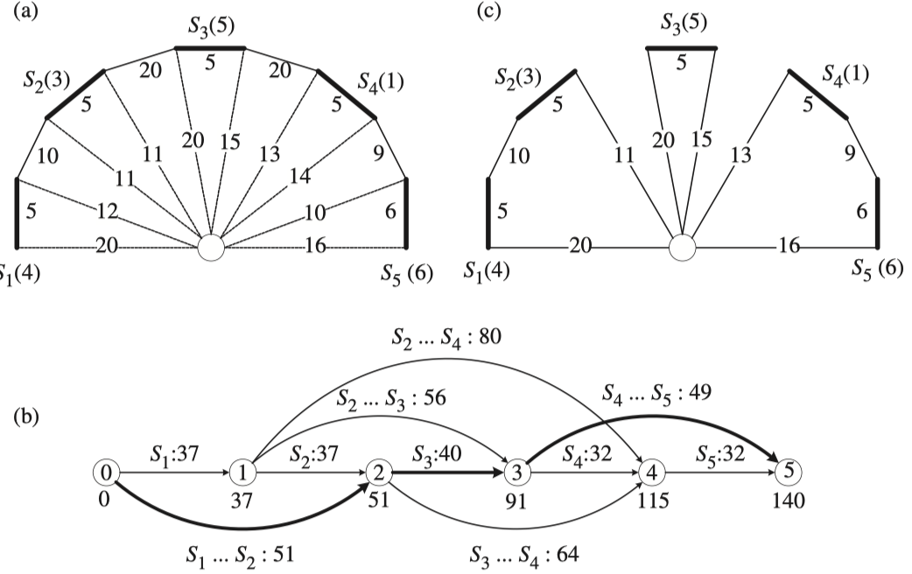
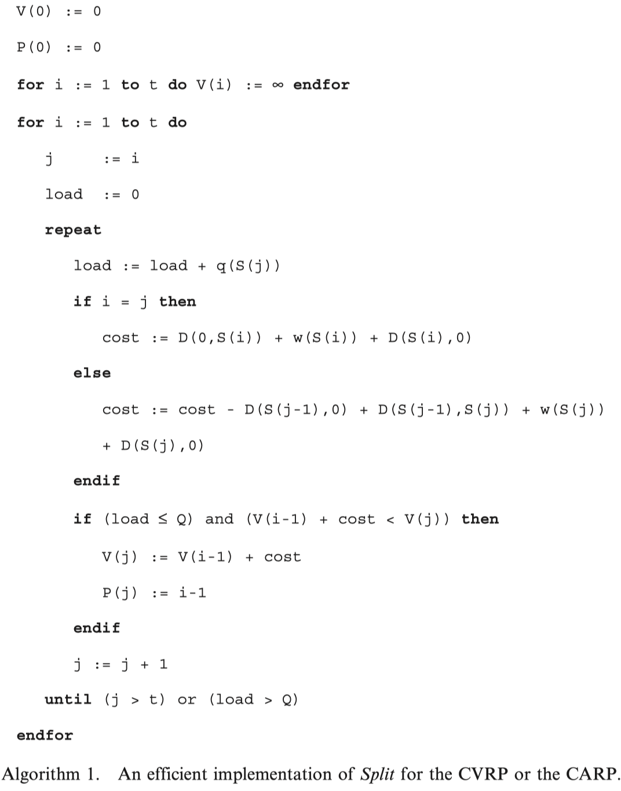
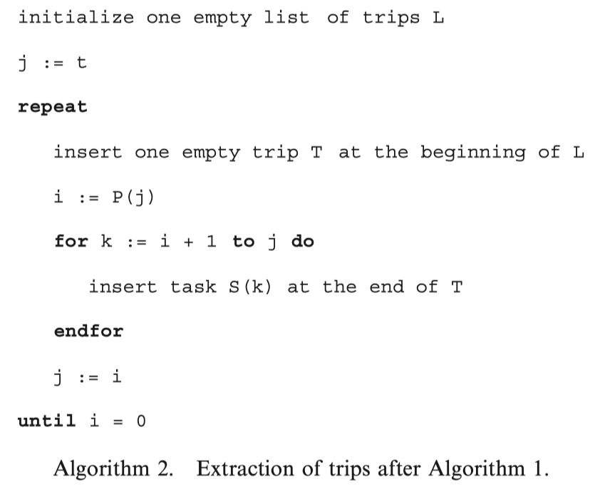

<!--
 * @Author: your name
 * @Date: 2020-11-23 15:21:26
 * @LastEditTime: 2020-11-24 20:58:06
 * @LastEditors: Please set LastEditors
 * @Description: In User Settings Edit
 * @FilePath: /note_md/papers/2009-prim-split.md
-->
# Title

Tour splitting algorithms for vehicle routing problems

## 0. Summary

写完笔记之后最后填，概述文章的内容，以后查阅笔记的时候先看这一段。注：写文章summary切记需要通过自己的思考，用自己的语言描述。忌讳直接Ctrl + c原文。

## 1. Research Objective

CARP和CVRP的构造启发式算法主要包括以下四类：
- 插入方法：通过不断插入任务建立一条条路径
- 合并方法：首先为每个任务构建一条路径，在不断合并这些路径
- 先聚类在规划路径的方法，首先为每辆车定义一个任务集合，然后为每个集合中的任务制定一个路径
- 路径优先，然后聚类的方法，首先对容量送至计算一个大路径，然后分割路径变为符合容量的小路径

本文聚焦于第四种方式，虽然之前因为性能差很少被采用，但是本文提出的方法能够有效提升该算法的表现。之后其还提出了基于随机的改进方法和邻域提升方法

## 2. Problem Statement

对于CVRP，仓点0和t个点任务在给定的完全图上，事先对距离矩阵D（t+1）*（t+1）进行计算。

对于CARP，仓点建模为一个额外的自循环，作为0号task，每条边被建模为两个方向相反的弧，共有2t个弧，方向相反的弧可以表示为$inv(i)=j,inv(j)=i$，因此有距离矩阵(2t+1)*(2t+1)表示两个弧之间的最短距离.

基本的split方法，首先通过TSP或RPP算法计算出一个giant tour S，对于一个大路径S，其成本可以计算为：
$$
C(S)=d(0,S_1)+\sum_{i=1}^{t-1}(w(S_i) + d(S_i, S_{i+1})) + w(S_t) + d(S_t, 0)
$$

## 3. Method(s)

### 基本算法

split方法通过建立一个0到t的有t+1个点的辅助图，将所有需求容量小于Q的子串建成一个弧，构成的DAG中，最短路径就是最优的split

算法1在实现时没有显式的生成辅助图H，对于每个任务$S_j$，有两个属性会被计算：$V_j$表示从点0到点j的最短路径成本，$P_j$表示$S_j$的前继节点。算法2根据生成了的两个数组信息恢复出路径划分。

### 增强算法

随机构造giant tour

**Random Task**

在一个限定的候选集中随机选择下一个任务。对于CARP，选择距离当前距离最小的任务集；对于CVRP，可能不存在多个最小的任务，选择最小距离一定比例的距离以内的所有任务作为候选任务集。

**RT flower**

负载的模小于一半是向远离仓点的方向随机选择，负载的模大于一半时向靠近仓点的方向随机选择。

**Random Criterion**

## 4. Evaluation

作者如何评估自己的方法，实验的setup是什么样的，有没有问题或者可以借鉴的地方。

## 5. Conclusion

作者给了哪些结论，哪些是strong conclusions, 哪些又是weak的conclusions?

## 6. Notes

(optional) 不符合此框架，但需要额外记录的笔记。

## Reference

(optional) 列出相关性高的文献，以便之后可以继续track下去。
