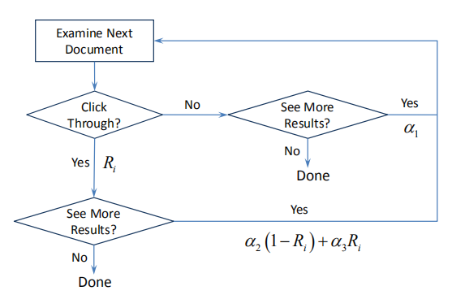
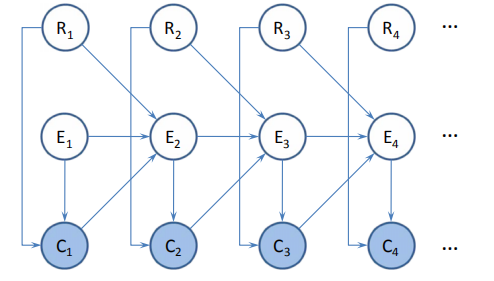
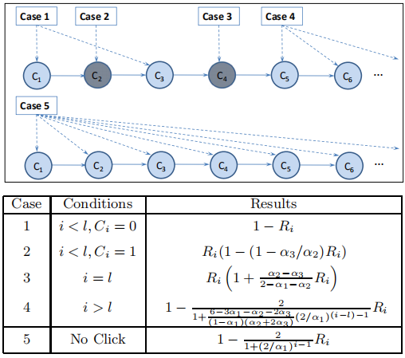
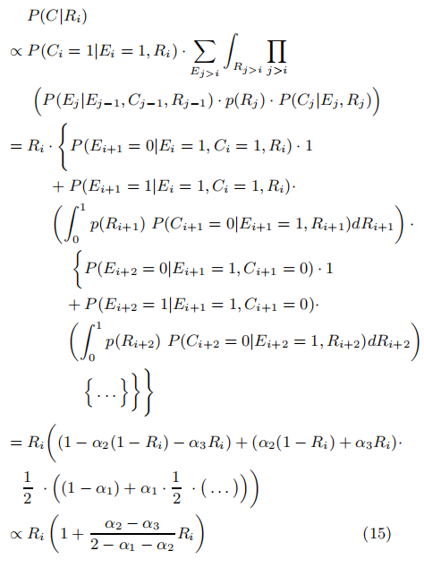
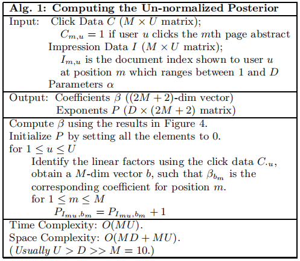
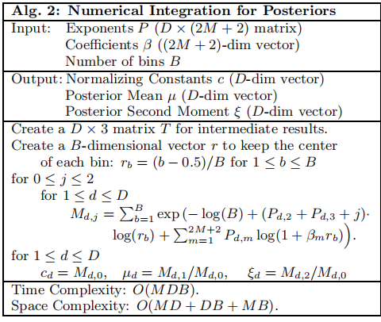

# Click Chain Model in Web Search 阅读笔记

学院:  计算机学院   学号:   M201973360      姓名:   王孙超

论文出处: WWW 2009
论文作者: Fan Guo, Chao Liu, Christos Faloutsos等

## 概括
能够增量计算的基于Bayes的click model, 核心是Bayes公式中的"证据"函数的计算, 以及模型中用户行为相关的参数的估计.

模型发展 cascade model - DCM&UCM - CCM
## Introduction
click model提供了一种方法来聚合用户搜索信息, 用以推断文档的"用户感知相关性", 而"用户感知相关性可以用于提升一些搜索相关应用的性能.

一个好的click model应当具有**可拓展性**和**支持增量计算**的性质, 在此前的研究中, cascade model, DCM, UCM等模型被提出, 都存在一些问题, 具体会在后文中展开, 因此这篇文章提出了CCM以改进.CCM的优点包括:基础, 可拓展, 高效等, 是一个基于bayes的概率模型.

## Background
### 概念与符号表示:
**query session:** 一个检索会话从一次查询提交开始, 重提交或对查询字段的编辑都视为不同的独立检索会话.

**document impression:** 第一页结果页上展示的文档的集合. click model舍弃了之后的页面, 相关查询和定向广告的内容, 可以表示为$D=\{d_1, d_2, \dots ,d_M\}$,通常M=10.

**examination, click:** 一次检视称为examination, 一次点击称为click, 它们都是概率事件, 用二项随机变量$E_i, C_i$表示i个文档是否被检视和点击.

**examination hypothesis:** 文档只有被检视才可能被点击, 文档被点击的概率等于文档的相关性.
$$
P(C_i=1|E_i=0)=0\\
P(C_i=1|E_i=1)=r_{d_i}
$$
其中$r_{d_i}$表示文档相关性, i文档是否被检视和点击, 与之前的检视和点击时间独立.所有click model都符合这样的定义, 但是对于$P(E_i)$存在不同的形式.

### cascade model
最基本的click model是cascade model, 该模型遵循*cascad hypothesis*, 即客户总从检索结果的第一条开始检查, 并严格的逐条向下, 即
$$
P(E_1=1)=1,\\
P(E_{i+1}=1|E_i=0)=0.
$$
除了上述两个hypothesis, 模型的额外约束包括用户会不断检视直到第一次点击,点击后不在看后面的文档直接遗弃当前的query session. 结合以上约束, 模型可以总结为下式
$$
P(E_{i+1}=1|E_i=1,C_i)=1-C_i \tag{1}
$$
模型的缺点:
- 没有考虑当在一个query session中发生多次点击时怎么表示以及怎么估计这种情况下的文档相关性.

### Dependent click model(DCM)
引入了一个点击事件后检视下一个文档的条件概率作为位置相关的参数, 将*cascade model*推广到多次点击的情形, 即
$$
P(E_{i+1}=1|E_i=1, C_i=1)=\lambda_i \tag{2}
$$
$$
P(E_{i+1}=1|E_i=1, C_i=0)=1, \tag{3}
$$
其中$\lambda_i$是行为参数, 全局共享. 模型的整体概率可以表示成
$$
P(C_{1:M})=\prod_{i=1}^l ((r_{d_i}\lambda_i)^{C_i}(1-r_{d_i})^{1-C_i})\cdot (1-\lambda_l+\lambda_l \prod_{j=l+1}^M(1-r_{d_j}))
$$
$l=argmax_{1\leq i\leq M}\{C_i=1\}$表示最后一个点击位置, 如果没有点击, l=0.

模型缺点:
- 模型假设了用户会扫视搜索结果的整个列表, 与现实不贴切.

### User browsering model(UBM)
该模型假设检视的概率$E_i$只与上一次点击的位置$l_i=argmax_{l<i}\{C_l=1\}$有关, 其中距离可以表示为$i-l_i$, $P(E_i)$的定义如下:
$$
P(E_i=1|C_{1:i-1})=\gamma_{l_i,i-l_i} \tag{5}
$$
因为$0 \leq l_i < i \leq M$, 总共有M (M + 1) / 2的用户行为参数$\gamma$.模型概率可以表示为
$$
P(C_{1:M})=\prod_{i=1}^M (r_{d_i}\gamma_{l_i,i-l_i})^{C_i}(1-r_{d_i}\gamma_{l_i,i-l_i})^{1-C_i} \tag{6}
$$

模型缺点:
- UCM模型通过最大似然学习参数, 并且通常需要多次迭代才能收敛,计算量相比DCM大了很多.
- 迭代意味着要对数据做多次遍历, 在增加计算同时意味着不能够增量更新.

## Click Chain Model
模型假设:
- 用户同构:对于相同的query,用户需要的信息相似
- 检视事件和点击事件解耦: 点击的概率只与当前位置的检视概率和文档的相关性有关
- 顺序检视:检视顺序严格按照序列, 没有跳过.

按照假设,有以下式成立
$$
P(C_i=1|E_i=0)=0 \tag{7}
$$
$$
P(C_i=1|E_i=1, R_i)=R_i \tag{8}
$$
$$
P(E_{i+1}=1|E_{i}=0)=0 \tag{9}
$$
$$
P(E_{i+1}=1|E_i=1,C_i=0)=\alpha_1 \tag{10}
$$
$$
P(E_{i+1}=1|E_i=1,C_i=1, R_i) = \alpha_2(1-R_i) + \alpha_3R_i \tag{11}
$$

此外, 有$P(E_1=1)=1$, $R_i$是独立同分布,服从[0,1]的均匀分布, 即$p(R_i)=1 \text{ for }0 \leq R_i \leq 1$.
按照流程图可以表示成

&nbsp;&nbsp;

figure 2&emsp;&emsp;&emsp;&emsp;&emsp;&emsp;&emsp;&emsp;&emsp;&emsp;&emsp;&emsp;&emsp;&emsp;&emsp;&emsp;&emsp;&emsp;&emsp;&emsp;&emsp;figure 3

相比其他click model区别: 通过一个合适的Bayes推断来预测文档相关性的后验分布. 文档相关性$R_i$是0-1的随机变量, 模型的训练包括得到$R_i$的后验分布和估计用户行为相关的参数$\alpha$.

## Algorithm
符号表述:
- $C^{1:U}$:对于同一个query的U个query session
- $P(R_i|C^{1:U})$: 待求后验概率

单个query session的概率可以直接按照figure2计算, 但是因为**随机变量值全局共享**, 多个session时可能形成环, 第一个能想到的办法是通过迭代解决, 但是文章提供的算法给出了另一种近似, 即给定$R_i$将session中点击事件看做条件独立的随机变量,
$$
p(R_i|C^{1:U})\approx (constant) \times p(R_i)\prod_{u=1}^{U} P(C^u|R_i) \tag{12}
$$

如果能计算出$P(C^u|R_i)$,则可以按照计算出一个关于$R_i$的常数的后验概率, $P(C^u|R_i)$的计算可以归纳为5种情况,其中l是最后一次点击事件的位置

 
figure 4

### 条件概率的计算

按照CCM的定义, 首先能够有以下几条性质,能够有效简化:
1. 对某一j, 若$C_j=1$, 有$\forall i\leq j, E_i=1$
2. 对某一j, 若$E_j=0$, 有$\forall i \geq j, E_i=0,C_i=0$
3. 若$E_i=1, C_i=0$, 则$P(E_{i+1}|E_i, C_i, R_i)=\alpha_1^{E_{i+1}}(1-\alpha_1)^{1-E_{i+1}}$, 与$R_i$无关.

Case1: $i < l, C_i=0$:

性质1,3得, $P(E_{i+1}=1|E_i=1, C_i=0,R_i)=\alpha_1$, 与$R_i$无关, 则关于$R_i$的常数都可以忽略.
$$
P(C|R_i)\propto P(C_i=0|E_i=1,R_i)=1-R_i \tag{13}
$$

Case2:
根据性质1, $E_i=1,E_{i+1}=1$, $R_i$的Markov blanket包括$C_i,E_i,E_{i+1}$

> Markov blanket 马尔科夫毯,将随机变量的集合U分成A, B和随机变量X三个部分, 如果给定A, 变量X和B集独立, 则称A为Markov blanket. 就是X只与集合A中的随机变量相关.

$$
P(C|R_i)\propto P(C_i=1|E_i=1,R_i)P(E_{i+1}=1|E_i=1,C_i=1,R_i) \propto R_i(1-(1-\alpha_3/\alpha_2)R_i) \tag{14}
$$

Case3:

根据性质1, $R_i$的Markov blanket不包含i以前的环境变量, 因此大于i的变量可以被加和到一起.

case4和case5需要对当前位置i后的所有随机变量加和, 同时它们和与最后一次点击的位置的距离相关, 因此总共分别有最多(M-1)和M个独立的结果, 5种情况的结果总数为1+1+1+M-1+M=2M+2.所有的条件概率可以表示为$R_i^{C_i}(1-\beta_jR_i)$的形式,其中$\beta_j$是依赖用户行为参数$\alpha$的case相关参数, 也就上是上面5种. 因此总共需要统计2M+2+1($R_i$的独立因子)的值, 就可以计算未归一化的后验分布. 算法如下:

按照算法计算出$\beta, P$, 文档的后验概率可以写作

$$
\tilde{p}_{R_d} \propto r^{P_{d,2} + P_{d,3}} \prod_{m=1}^{2M+2}(1-\beta_mr)^{P_{d,m}} \tag{16}
$$

### 后验概率数值积分
利用积分中点法则离散化r后, 对后验概率可以按照下式积分
$$
\int 0^1 r^j\tilde{p}(r)dr \approx \frac{1}{B} \sum_{b=1}^{B} r_b^{P_{d,2}+P_{d,3}+j} \prod_{m=1}^{2M+1}(1+\beta_{mr_b})^{P_{d,m}} \tag{16}
$$

数值积分过程写成算法如下:

为了避免精度问题, 通常会将连乘变为log进行计算. 通常,对于后验概率点的估计$E_{p(r)}[f(r)]$, 可以简单用$f(r_b)$代替$r_b^j$, 饼子啊结果中除以一个归一化常数c.

### 参数估计
对于单个query session,$p(C|\alpha)$可以通过对$R_i$和$E_i$积分得到, 计算过程与(15)式类似,再将不同的query session进行累加,得到对数似然函数
$$
l(\alpha)=N1log\alpha_1+N2log\alpha_4+N_3log (6-3\alpha_1-\alpha_4)\\+N_5log(1-\alpha_1)-(N_3+N_5)log(2-\alpha_1)-N_1log2-(N_2+N_3)log6 \tag{17}
$$
其中$\alpha_4=\alpha_2+2\alpha_3$, $N_i$是文档落入到第i个case的次数, 对是上式求最大似然得到
$$
\alpha_1=\frac{3N_1+N_2+N_5-\sqrt{(3N_1+N_2+N_5)^2-8N_1(N_1+N_2)}}{2(N_1+N_2)}\\
\alpha_4=\frac{3N_2(2-\alpha_1)}{N_2+N_3}
$$
上式说明, $\alpha_2, \alpha_3$的选择,可以调整, 可以根据模型应用调整$\alpha_2/\alpha_3$.

### 增量更新
当新的数据进来时, 使用algo1对P中的计数进行更新,如果必要的话,可以继续对后验相关性的估计进行更新.

## 实验与总结部分
文章在实验部分, 选择了商业搜索引擎上的880万条query session作为数据集, 对CCM,UBM, DCM进行测试并对比, 在采用的一系列准则上, CCM都比其他的模型表现更好.

文章的总体思路就是使用bayes的模型来对检索会话进行建模, 文档有自己的先验的相关性, 然后根据在会话中的位置和被点击情况, 会产生一些证据来强化或削弱该相关性, 这些证据的计算通过一些假设保证了局部相关性, 因此能够加速计算和增量计算.

比较不好理解的部分在最后参数估计的部分, 但是尽管操作复杂, 归结到操作层面还是比较简洁的.