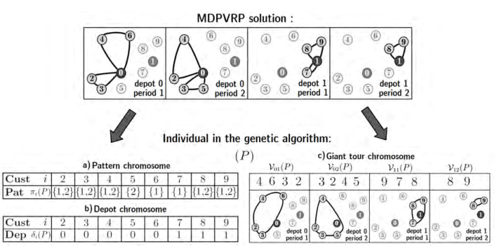
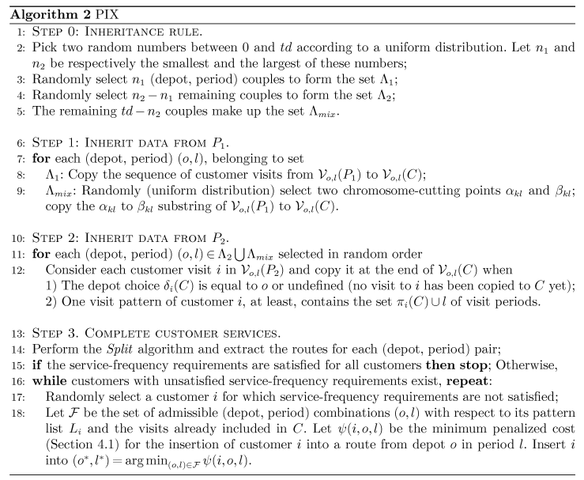

# 2012-OR-Vidal-HGSADC

## 文章概况

- 突出贡献
  - 提出一种新的启发式算法, 可以解决三类VRP变种问题
  - 提出新的种群多样性管理机制

## 问题定义
完全图$G = (V,A)$, 包含$|V|=n+1$个节点, 节点分为两部分$V=V^{DEP}\cup V^{CST}$

## 搜索空间的定义

- 车辆容量松弛和最大行驶时间松弛
- 对应惩罚系数$w^Q$和$w^D$分别表示是容量的惩罚系数和最大时间间隔的惩罚系数. 路径r惩罚后的成本表示为
$$\phi(r) = c(r) + \omega^D max\{0, \tau(r) - T)\} + \omega^Q max\{0, q(r) - Q\}$$
- 解s的带惩罚的成本则为$\phi(s) = \sum_{r\in R(s)} \phi(r)$

## 结果表示

- 一个解由客户计划, 仓点分配和路径构成.
- 在遗传算法中, 上述信息被3个染色体表征:
  - 模式染色体: $\pi_i(P)$, 对于PCVRP, 模式代表着需要在哪几天给该用户送货, 具体编码中, 按位表示, 例如 总共5天, 用户需要被送两次货, 分别在第一天和第二天, 表示成编码就是B11000.
  - 仓点分配染色体: $\delta_{i}(P)$每个用户会分配给一个仓点负责, 多次送货时, 同一个用户对应的仓点不会变化
  - giant tour染色体: 将(depot o, period l)中所有路径以任意顺序连接起来形成一个giant tour
- 对于一个(depot, period)包含的路径, 将它们连接成一个giant tour的好处在于, 可以用简单有效的crossover方法进行扰动. 而将它们分成实际的多个路径时, 采用的高效的split算法.

## 个体评价

传统的只按照目标函数制定fitness func的方式存在短视的问题, 忽略了种群的多样性. 文章提出的考虑个体多样性的评价方法. 对于个体P, 提出多样性贡献$\Delta(P)$, 表示它和离它最近的$n_{close}$的邻居的平均距离, 这个邻居的集合称为$N_{\lfloor \updownarrow \wr \int \rceil}$. $\Delta(P)$的计算如下:
$$
\Delta(P) = \frac{1}{n_{close}} \sum_{P_2\in N_{\lfloor \updownarrow \wr \int \rceil}} \delta^H (P, P_2) \\
\delta^H (P, P_2)=\frac{1}{2n}\sum_{i=1,\dots,n}(1(\pi_i(P_1) \neq \pi_i(P_2)) + 1(\delta_i(P_1) \neq \delta_i(P_2)))
$$

而Biased fitness func BF(P)如下:
$$
BF(P) = fit(P) + (1 - \frac{nbElit}{nbIndiv})dc(P)
$$
其中nbElit表示下一代能存活的数量. fit(P)和 dc(P)的取值都为$\{1, \dots, nbIndiv\}$, 表示的是在大小为nbIndiv的子种群中, 当前个体关于$\phi(P)$和$\Delta(P)$的排名.

两个子种群(可行种群和不可行种群)的排名和BF都在不断更新, 用于在Parent Selection和Survivor Selection环节评价个体的质量.

 ## 父母选择和杂交
 P1, P2 -> C

 

 ## 种群管理

- 包含两个种群, 可行和不可行, 每个种群的数量在$\mu \sim \mu+\lambda$之间. 当种群数量达到最大值后, 会启动一次survivor selection的过程, 把种群中个体数量降到最低值.
- 初始化: 随机选择pattern和depot, 生成$4\mu$数量的个体, 个体经过50%概率的教育和修复过程, 并加入到最终对应的种群中, 进行幸存者选择. 初始化结束时, 某个种群的个体数量可能会小于最小值.
- 惩罚系数的调整. 惩罚系数初始时设为$\omega^D=1, \omega^Q=\bar{c}/\bar{q}$, 其中$\bar{c}$是节点之间的平均距离, $\bar{q}$是平均需求. 这两个参数在算法执行过程中动态调整. 令$\xi^Q, \xi^D$分别表示最近100个生成的个体中, 容量和里程约束满足的比例, $\xi^{REF}$表示的是目标比例, 
  - 当$\xi^{PAR} \leq \xi^{REF} - 0.05$时, $\omega^{PAR} = \omega^{PAR} \times1.2$
  - 当$\xi^{PAR} \geq \xi^{REF} + 0.05$时, $\omega^{PAR} = \omega^{PAR} \times0.85$
- 多样性控制. 如果$It_{div}$迭代都没有更优解产生, 每个种群中最好的$\mu/3$个体会被清除, 然后加入$4\mu$的新的个体, 重复初始化的流程
- 多样性和幸存者选择. 
  - 种群算法的一个挑战是如何不发生早熟
  - 本文的解决方法, 让搜索过程自发的保留最可能的解的好的特点, 和保证两个种群的多样性
  - 