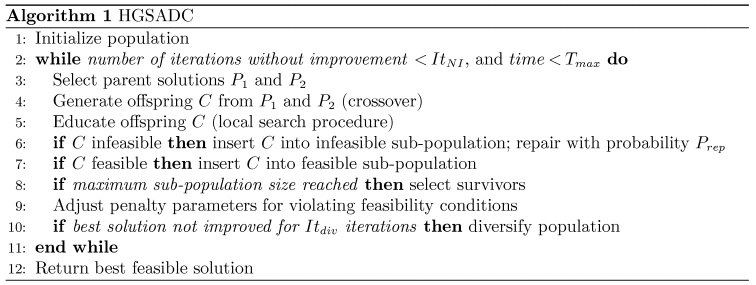
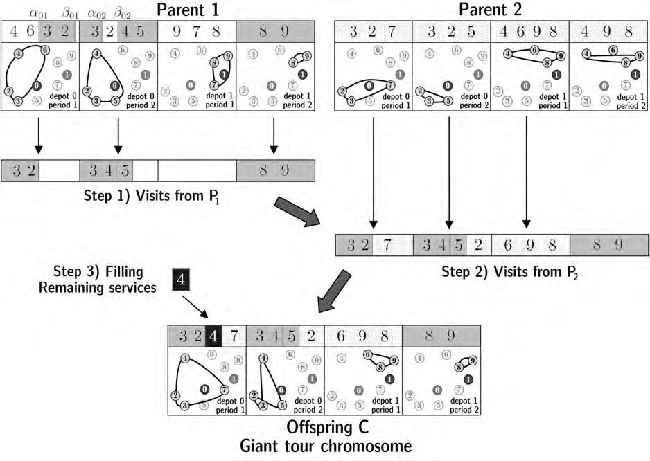
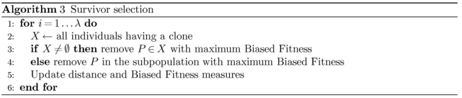

# 2012-OR-Vidal-HGSADC

## 文章概况

- 突出贡献
  - 提出一种新的启发式算法, 可以解决三类VRP变种问题
  - 提出新的种群多样性管理机制
  - 提出一种高效的后代"教育"方案, 整合了邻域搜索类的搜索方法中的优点和高效


## 问题定义

- MDVRP, PVRP, MDPVRP三类问题, 均包含行驶时间约束和容量约束
- 三个问题之间的关系:MDPVRP, 当d=1时, 为PVRP; 当t=1时, 为MDVRP.
- MDPVRP的基本约束:
  - MD约束中每个depot有m辆车, 存在多个depot
  - P约束中, 每个客户有一个服务频率$f_i$, 需要在t个周期中选择$f_i$个服务该点, 而选择在哪几个周期访问该点的方案称为模式(pattern). PVRP问题中需要为每个节点选择一个模式, 然后建立t个周期中的每个周期的访问路径.
  - MDPVRP问题中, 需要对每个客户节点分配一个depot以及确定一个模式, 并根据上述两个选择确定每天每个depot的路径集合.
- 最终MDPVRP问题可以被转换为有$d\times t$个周期的PVRP问题.

## 搜索空间的定义

- 车辆容量松弛和最大行驶时间松弛
- 对应惩罚系数$w^Q$和$w^D$分别表示是容量的惩罚系数和最大时间间隔的惩罚系数. 路径r惩罚后的成本表示为
$$\phi(r) = c(r) + \omega^D max\{0, \tau(r) - T)\} + \omega^Q max\{0, q(r) - Q\}$$
- 解s的带惩罚的成本则为$\phi(s) = \sum_{r\in R(s)} \phi(r)$

## 结果表示

- 一个解由客户模式, 仓点分配和路径构成.
- 在遗传算法中, 上述信息被3个染色体表征:
  - 模式染色体: $\pi_i(P)$, 对于PCVRP, 模式代表着需要在哪几个周期给该用户送货, 具体编码中, 按位表示, 例如 总共5天, 用户需要被送两次货, 分别在第一天和第二天, 表示成编码就是0b11000.
  - 仓点分配染色体: $\delta_{i}(P)$每个用户会分配给一个仓点负责, 多次送货时, 同一个用户对应的仓点不会变化
  - giant tour染色体: 将(depot o, period l)中所有路径以任意顺序连接起来形成一个giant tour
- 对于一个(depot, period)包含的路径, 将它们连接成一个giant tour的好处在于, 可以用简单有效的crossover方法进行扰动. 而将它们分成实际的多个路径时, 采用的高效的split算法.


## 算法整体流程



一个基本的GA算法的流程
- 初始化
- 评价解
- 重组(杂交)
- 突变
- 替换

本文中的GA改进较大的部分在重组和替换两个过程, 并且突变部分被替换为一个LS.

## 个体评价

传统的只按照目标函数制定fitness func的方式存在短视的问题, 忽略了种群的多样性. 文章提出的考虑个体多样性的评价方法. 对于个体P, 提出多样性贡献$\Delta(P)$, 表示它和离它最近的$n_{close}$的邻居的平均距离, 这个邻居的集合称为$N_{\lfloor \updownarrow \wr \int \rceil}$. $\Delta(P)$的计算如下:
$$
\Delta(P) = \frac{1}{n_{close}} \sum_{P_2\in N_{\lfloor \updownarrow \wr \int \rceil}} \delta^H (P, P_2) \\
\delta^H (P, P_2)=\frac{1}{2n}\sum_{i=1,\dots,n}(1(\pi_i(P_1) \neq \pi_i(P_2)) + 1(\delta_i(P_1) \neq \delta_i(P_2)))
$$

而Biased fitness func BF(P)如下:
$$
BF(P) = fit(P) + (1 - \frac{nbElit}{nbIndiv})dc(P)
$$
其中nbElit表示下一代能存活的数量. fit(P)和 dc(P)的取值都为$\{1, \dots, nbIndiv\}$, 表示的是在大小为nbIndiv的子种群中, 当前个体关于$\phi(P)$和$\Delta(P)$的排名.

两个子种群(可行种群和不可行种群)的排名和BF都在不断更新, 用于在Parent Selection和Survivor Selection环节评价个体的质量.

 ## 父母选择和杂交
 P1, P2 -> C

 


### 一个例子


t*d 共有4个大路径, 假设划分为$\Lambda_1=\{(d1,p2)\}, \Lambda_2=\{(d1,p1)\}, \Lambda_{mix}=\{(d0,p1),(d0,p2)\}$.

第一步, 从P1继承信息. 对于$\Lambda_1$的直接拷贝下来, 对于$\Lambda_{mix}$的, 随机切片拷贝下来放在最前面.

第二步, 从P2继承信息. 对于$\Lambda_2 \bigcup \Lambda_{mix}$的大路径, 考量P2中的每个客户, 如果(1)客户的仓点未分配或者与当前大路径对应的仓点一致;(2) 客户的访问pattern能够兼容, 则将这个客户加在对应大路径的最后.

注意这一步中的4号客户, 在第一步该用户已经分配给仓点0, 因此在第二步的(1,1)大路径中, 不能再包含该客户.

第三步, 修复不可行. 对于不满足派送频次的节点, 在所有可以加入的大路径中, 寻找一个插入成本最小的位置, 将该客户插入.

 ## 种群管理

- 包含两个种群, 可行和不可行, 每个种群的数量在$\mu \sim \mu+\lambda$之间. 当种群数量达到最大值后, 会启动一次survivor selection的过程, 把种群中个体数量降到最低值.
- 初始化: 随机选择pattern和depot, 生成$4\mu$数量的个体, 个体经过50%概率的教育和修复过程, 并加入到最终对应的种群中, 进行幸存者选择. 初始化结束时, 某个种群的个体数量可能会小于最小值.
- 惩罚系数的调整. 惩罚系数初始时设为$\omega^D=1, \omega^Q=\bar{c}/\bar{q}$, 其中$\bar{c}$是节点之间的平均距离, $\bar{q}$是平均需求. 这两个参数在算法执行过程中动态调整. 令$\xi^Q, \xi^D$分别表示最近100个生成的个体中, 容量和里程约束满足的比例, $\xi^{REF}$表示的是目标比例, 
  - 当$\xi^{PAR} \leq \xi^{REF} - 0.05$时, $\omega^{PAR} = \omega^{PAR} \times1.2$
  - 当$\xi^{PAR} \geq \xi^{REF} + 0.05$时, $\omega^{PAR} = \omega^{PAR} \times0.85$

- 多样性控制. 如果$It_{div}$迭代都没有更优解产生, 每个种群中最好的$\mu/3$个体会被清除, 然后加入$4\mu$的新的个体, 重复初始化的流程
- 多样性和幸存者选择. 
  - 种群算法的一个挑战是如何不发生早熟
  - 本文的解决方法, 让搜索过程自发的保留最可能的解的好的特点, 和保证两个种群的多样性
  - 第一个是在父母选择时, 显式的定义和考虑多样性
  - 第二个是加入幸存者选择机制, 保留了visit pattern多样化的和cost小的个体, 而将clone个体(具有相同的visit pattern和仓点分配的个体, 即$\delta^H(P_1, P_2)$)和成本上差的个体剔除. 具体的流程如下:



- 文章还提出的定理证明: 自种群中的cost排前nbElit的个体不会在幸存者选择阶段被剔除.

## 代码分析
### 初始化


```cpp
Population::Population(Params * params) : params(params)
{
	// ...
	// Creating the initial populations
	for (int i=0 ; i < params->mu && (!params->isSearchingFeasible || !feasibleFound) ; i++ )
	{
		randomIndiv = new Individual (params, true);
		// education中包括了一个LS过程
		education(randomIndiv);
		addIndividu(randomIndiv) ;
		updateNbValides(randomIndiv);
		if (!randomIndiv->isValid)
		{
		    // 这里临时提高惩罚系数, 迫使搜索向可行域走, 文章中的惩罚系数更新在generPenality中
			temp = params->penalityCapa ;
			temp2 = params->penalityLength ;
			params->penalityCapa *= 10 ;
			params->penalityLength *= 10 ;

			trainer->recopieIndividu(trainer,randomIndiv);
			trainer->generalSplit();
			trainer->updateLS();
			trainer->localSearch->runSearchTotal();
			trainer->updateIndiv();
			params->penalityCapa = temp ;
			params->penalityLength = temp2 ;
			trainer->generalSplit();
			trainer->recopieIndividu(randomIndiv,trainer);
			addIndividu(randomIndiv) ;
		}
		if (randomIndiv->isValid) feasibleFound = true ;
		delete randomIndiv ;
	}
	// ...
}
```

### repair
repair的实质也是一次LS. 不同的是提高了惩罚系数. repair也并不保证修复成功
```cpp
void Genetic::repair ()
{
	double temp, temp2  ;

	temp = params->penalityCapa ;
	temp2 = params->penalityLength ;

	// First Tentative of Repair
	params->penalityCapa *= 10 ;
	params->penalityLength *= 10 ;
	offspring->updateLS();
	offspring->localSearch->runSearchTotal();
	offspring->updateIndiv();

	// If the first tentative failed, second tentative with higher penalty
	if (!offspring->isValid)
	{
		params->penalityCapa *= 10 ;
		params->penalityLength *= 10 ;
		offspring->generalSplit();
		offspring->updateLS();
		offspring->localSearch->runSearchTotal();
		offspring->updateIndiv();
	}

	params->penalityCapa = temp ;
	params->penalityLength = temp2 ;
	offspring->measureSol();
}

```
### crossover
```cpp
int Genetic::crossPIX ()
{
	vector < int > empty, keep, daysDisturb, boardEnd, boardStatus ; //  daysDisturb -- 扰动日期
	vector < vector <int> > keep2 ;
	int jj,i,ii,j,temp,size ;
	int start, end, day ;
	int j1,j2 ;
	int placeInsertion ;

	// We initialize some little data structures
    initialInCrossPIX();

    // We take the days in random order
    disturbDays(daysDisturb);

    // We pick j1 and j2. j1 < j2 < nbDays
    generateN1AndN2ForSplitPopulation(j1, j2);

    // init keep2, store the incomplete chromT
	for (int k = 0 ; k <= params->nbDays ; k ++ )
		keep2.push_back(empty);

	// Inheriting the visits
	for (int k = 0 ; k < params->nbDays ; k ++ )
	{
		day = daysDisturb[k];

		// First case, we copy a segment (these visits will be temporarily kept in the data structure "keep2") ^mix
		if (k < j1 && !offspring->chromT[day].empty())
		{
		    // generate alpha_i and beta_i
            start = (int)(rand() % offspring->chromT[day].size()) ;
            end = (int)(rand() % offspring->chromT[day].size()) ;
			boardEnd.push_back(end);
			j = start ;
			while ( j != ((end + 1) % offspring->chromT[day].size()) )
			{
                serviceCustom(offspring->chromT[day][j], day);
				keep2[day].push_back(offspring->chromT[day][j]) ;
				j = (j+1) % offspring->chromT[day].size() ;
			}
			offspring->chromT[day].clear();
		}
		else if (k < j2) // Second case, we copy nothing on this day ^2
		{
			offspring->chromT[day].clear() ;
			boardEnd.push_back(-1);
		}
		else // Third case, we copy everything on this day ^1 set
		{
			boardEnd.push_back(0);
			// 遍历的是某一天的所有tour
			for (j=0 ; j < (int)offspring->chromT[day].size() ; j++)
			{
                serviceCustom(offspring->chromT[day][j], day);
			}
		}
	}

	// We complete with the second parent
	for (int k = 0 ; k < params->nbDays ; k ++ )
	{
		day = daysDisturb[k] ;
        end = boardEnd[k] ;
		if (k < j2)
		{
			for (i=0 ; i < (int)offspring2->chromT[day].size() ; i++)
			{
			    // customer not in temp tour
				ii = offspring2->chromT[day][(i + end + 1) % (int)offspring2->chromT[day].size() ] ;
				bool ableToAppend = freqClient[ii] != 0
                                    && params->cli[ii].jourSuiv[offspring->chromP[ii].pat][(day - 1) % params->formerNbDays + 1] == (int)((day - 1) % params->formerNbDays + 1)
                                    && (offspring->chromP[ii].dep == -1 || offspring->chromP[ii].dep == (day - 1) / params->formerNbDays );
				if (ableToAppend)
				{
					offspring->chromT[day].push_back(ii);
                    serviceCustom(ii, day);
				}
			}
		}
	}

	// we complete with the elements of keep2 (which come from the first parent for the days where the parents are mixed)
	for (int k=1 ; k<=params->nbDays ; k++)
	{
		keep.clear();
		// Choose a random place of insertion
		size = (int)offspring->chromT[k].size() ;
		if (size != 0) placeInsertion = rand() % size ; 
		else placeInsertion = 0 ;
		for (int iii=placeInsertion ; iii <  size ; iii ++)
			keep.push_back(offspring->chromT[k][iii]);
		for (int iii=placeInsertion ; iii <  size ; iii ++)
			offspring->chromT[k].pop_back();
		for (int iii=0 ; iii < (int)keep2[k].size() ; iii ++)
			offspring->chromT[k].push_back(keep2[k][iii]);
		for (int iii=0 ; iii < (int)keep.size() ; iii ++)
			offspring->chromT[k].push_back(keep[iii]);
	}

	offspring->toPlace.clear();
	// We gather in "toPlace" those elements with missing visits
	for (i=0 ; i < params->nbClients + params->nbDepots ; i++ )
	{
		if (freqClient[i] > 0)
		{
			for (j=0 ; j< freqClient[i] ; j++)
				offspring->toPlace.push_back(i);
		}
	}

	// We randomize toPlace
	for (i = 0 ; i < (int)offspring->toPlace.size() ; i++)
	{
		jj = i + rand() % ((int)offspring->toPlace.size() - i) ;
		temp = offspring->toPlace[i] ;
        offspring->toPlace[i] = offspring->toPlace[jj] ;
        offspring->toPlace[jj] = temp ;
	}

	// We call Split to obtain a full solution
	offspring->generalSplit();
	offspring->updateLS();
	offspring->localSearch->placeManquants(); // and we perform a least-cost insertion of the missing visits
	offspring->updateIndiv();

	return 0 ;
}

```

完整代码重构和注释: [github](https://github.com/caidwang/HGS-CARP/tree/wsc-learn)