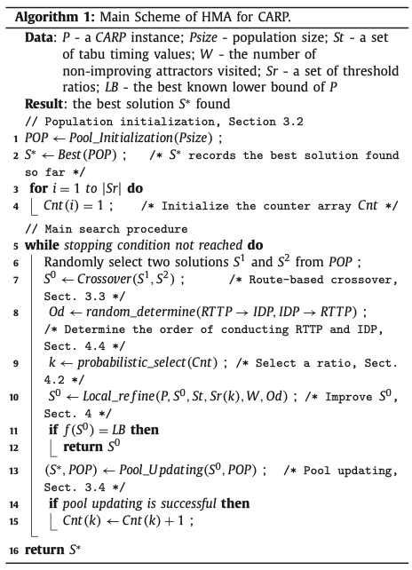

<!--
 * @Author: your name
 * @Date: 2021-03-04 19:57:56
 * @LastEditTime: 2021-03-18 21:39:17
 * @LastEditors: Please set LastEditors
 * @Description: In User Settings Edit
 * @FilePath: /note_md/papers/2016-EJOR-chen-HMA.md
-->

# Title

A hybrid metaheuristic approach for the capacitated arc routing problem

## 0. Summary

写完笔记之后最后填，概述文章的内容，以后查阅笔记的时候先看这一段。注：写文章summary切记需要通过自己的思考，用自己的语言描述。忌讳直接Ctrl + c原文。

## 1. Research Objective

提出一种混合进化算法，结合随机禁忌搜索和非可行下降策略，解决CARP问题。

## 2. Problem Statement

文章对每个有需求的任务分配两个ID（i,i+n)，其中i属于\[1,n\], 每个ID表示一个有需求的弧。将depot定义成特殊的任务点，插入在路径的开始和结束位置。对于m辆车和n个需求的算例，有n+m+1个任务。目标是
$$f(S)=\sum_{i=1}^{n+m}(tc(S(i))+dist(S(i)+S(i+1))$$
其中tc是任务弧的通过成本，S(i)是该解的第i个ID。

## 3. Method(s)

- 总体上种群算法在CARP上的表现较其他元启发式算法更好
- 一个好的进化算法非常依赖两个关键组件的设计：交叉操作符和局部强化过程
- 文章提出的方法通过禁忌搜索找到高质量的可行解，同时通过允许非可行解的下降过程实现穿越不可行域的能力
- 通过质量+距离的策略管理种群

### 混合元启发式算法
#### 整体流程
- 每轮迭代只更新种群中的一个解
- 初始解通过路径扫描的greedy方法构造并通过一个局部强化过程得到初始解。
- 每轮迭代随机从种群选取两个解S1和S2，通过一个基于路径的交叉算子（RBX）获得一个子代解S0。RBX总体上的操作是将其中一个解的一条路径代替另一个解的一条路径，然后进行修复。
- 在局部强化的阶段会调用两个子过程，一个随机化的禁忌筛选过程（RTTP），一个是非可行下降过程（IDP）。两者的顺序是在局部强化阶段开始是随机确定的

- RTTP的随机化体现在，RTTP过程首先需要一个门限比例，这个比例按照$Pr(i)=Cnt(i)/\sum_{i=1}^{|Sr|}Cnt(i)$的概率从Sr集合中选择一个值，如果在这轮迭代中子代S0被成功的插入进了种群当中，则对应的cnt加一。
- 算法结束条件：达到最大代数或者达到算例下界

**RBX**

- 进化算法对好的重组算子有较强依赖，这种算子需要能够将有价值的属性从父代传递到子代
- RBX的基本流程：在两个父代解中各随机选择一个路径进行交换，得到子代，收集子代中没有服务的任务，同时对于重复服务的任务，根据greedy的思想去除成本更高的访问。
- 对于没有服务的任务，进行随机排序后，对每个任务扫描所有可能插入的位置，以最小成本插入。
- RBX在结构性的对现有解进行修改的同时，通过一些启发式的方法，保证了解的质量
- RBX过程的复杂度是O(n2)

**种群管理**

- 种群管理的目的是避免搜索出现过早收敛的问题
- 文章首次在CARP中引入了Hamming距离来作为多样性的距离计算

### 局部搜索的强化机制

**RTTP**

**IDP**

## 4. Evaluation

作者如何评估自己的方法，实验的setup是什么样的，有没有问题或者可以借鉴的地方。

## 5. Conclusion

作者给了哪些结论，哪些是strong conclusions, 哪些又是weak的conclusions?

## 6. Notes

(optional) 不符合此框架，但需要额外记录的笔记。

## Reference

(optional) 列出相关性高的文献，以便之后可以继续track下去。
