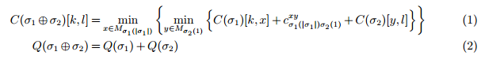
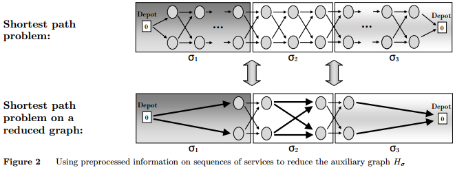
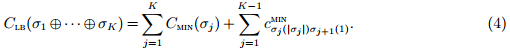
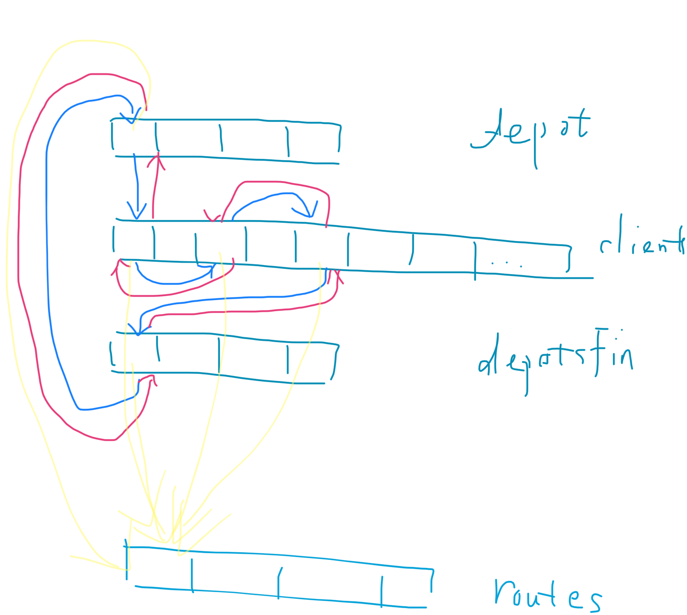
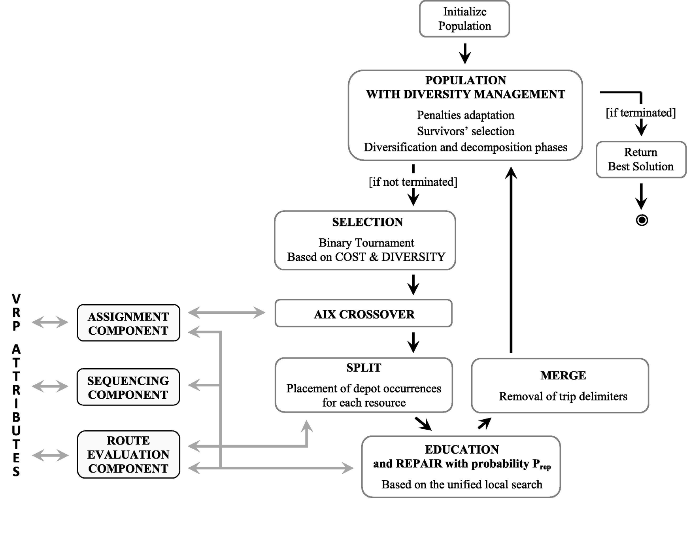

# 2017-Vidal-NEARP

## 文章概况

- 关键技术: 记忆结构, 双向动态规划, 下界估计, 邻域空间结构的设计
- 解决思路: 模式选择的最优化在邻域评价过程通过dp完成
- 突出贡献: 对于带有最优方向选择的一个服务序列(例如ARP的情形)上进行的经典邻域操作, 提出O(1)时间复杂度的评价方法; 将最优方向的选择一般化为一个service的mode的最优选择, 进而将成果应用到Ejection chains和其他两种元启发式搜索中.
- 计算实验: 算法优化适用于CARP, MCGRP, periodic CARP, multi-depot CARP, min-max k-vehicles windy rural postman problem.

## 概念要点:

VRP vs ARP
- node routing中, 最短路决策隐含在距离矩阵计算中, arc routing中, 路径决策会收到服务顺序的影响, 同时也会受到mode选择(如服务方向, 转向限制, 交叉口延误)等的影响
- ARP的计算量大致是VRP的四倍

对ARP的问题求解的建模:
- service: 例如在ARP中, 一个service是节点i和节点j之间的需求(与arc的方向无关)
- mode: 具体的arc方向, 是从i->j还是从j->i, 因此在ARP中, mode的数量为2
- 将ARP求解分为四个步骤, ASSIGNMENT, SEQUENCING, MODE CHOICES, PATH bewteen services
  - Asignment: 决定一个service由哪个route去服务; 
  - Sequence: 决定在一个route中的service的顺序; 
  - Mode: 决定一个service所采用的mode; 
  - Path: 在service k和l的模式确定的前提下, 确定两个service之间的最短路径

提高LS性能的关键:
- 一个邻域操作的评价复杂度压缩到O(1)
- 减少需要搜索的决策数, 缩小搜索空间
- 高效剪枝不可能的邻域变换(用LB代替精确评价), 缩小搜索空间

文章中对应的方案:
- 对当前解的sequence进行预处理计算子序列的成本, 用子序列的concat表示邻域操作, 进而有限次数的concat就可以计算新解成本O(1); 联系Vidal2011a
- 将求解分层后, ASIGNMENT, SEQUENCE前两层用搜索解决, 这时解决的就是VRP问题(只不过计算最短路或成本时, vrp是去查距离矩阵, 这里是用dp计算), 下层用dp做, 因此缩小了决策维度
- 提出了concat时估计下界的方法, 代替精确计算新解成本 [找高效的LB的方法和思想同样适用VRP]

## 具体细节:

### 1. 对ARP问题的建模和表示
<div align="center">

</div>

- R1: 一个解中显式的包含了ASSIGNMENT, SEQUENCING, MODE CHOICES, PATH bewteen services四个层次的决策子集; 不常用, 需要搜索所有决策的组合
- R2A: R2A的表示方法确定确定了ASSIGNMENT, SEQUENCING, MODE CHOICES, Path通过两个service的具体mode下的endpoint之间的最短路径得到. 需要计算最短路径. 常用, 但是sequence和mode紧耦合, 有些邻域操作需要同时修改这两个决策子集
- R2B: R2B的表示里, 所有service在一个big trip中没有分多个route, 这种表示常用于群算法的crossover操作. 需要O(n^2)的split算法. 不适用于LS阶段. 这类元启发式通常在LS阶段也采用R2A.
- R3: R3A和R3B的区别也是是否需要后续的split操作. R3的表示只包括了ASSIGNMENT, SEQUENCING两部分, 它们将mode的决策用dp子问题解决, 因此保证了这些决策的最优性

### 2. 带最优mode决策的邻域搜索

符号表

|symbol | remark|
|-|-|
|$x \in X$| solution, a set of Routes R(x)|
|$\sigma \in R(x)$| route, $\sigma=(\sigma(1),\sigma(2),\dots,\sigma(\|\sigma\|)$, $\sigma(1) = \sigma(\|\sigma\|) = 0, depot$|
|$s_i^k$|cost of service i in mode $k \in M_i$, $s_0^1=0$ for depot|
|$c_{ij}^{kl}$|cost of travel between service i in k mode and service j in mode l|
|$H_{\sigma}=(V_{\sigma}, A_{\sigma})$|an acyclic auxiliary graph illustrated in follow picture|
|$C(\bar{\sigma})[k,l]$|the cost of the partial shortest path in $H_{\bar{\sigma}}$ between the first and last service in the sequence, for any combination of modes k and l|

上述的辅助无环图: 每个service是在一列, service的每个mode是一个节点, 之间的连线的cost是$c_{ij}^{kl}$
<div align="center">

</div>

**基于concat的邻域操作评价**

首先通过O(n^2)复杂度的预处理, 计算当前解的子序列的$C(\bar{\sigma})[k,l]$, 之后在进行邻域操作时, 只需要按照下式计算两个子序列$\sigma_1$和$\sigma_2$连接得到的新解的cost.
<div align="center">

</div>

这个计算相当于在上述辅助无环图的简化图(concat时可以看做三个节点, 如下图)上计算Floyd最短路.

<div align="center">

</div>

**cost下界的计算**

要使邻域操作得到的新解有提升, 则要求$\Delta_\pi=C(\sigma_1')+C(\sigma_2')-C(\sigma_1)-C(\sigma_2) < 0$, 则必有$\Delta_\pi^{LB}=C_{LB}(\sigma_1')+C_{LB}(\sigma_2')-C(\sigma_1)-C(\sigma_2) < 0$满足, 如果$\Delta_\pi^{LB}$不满足的话, 则不需要进一步精确计算cost.

一个路径$\sigma=\sigma_1\oplus\dots\oplus\sigma_K$的下界可以写成

<div align="center">

</div>

这样的LB能够平均去除90%的邻域操作, 使得精确评价的计算量不再是计算的瓶颈.

具体的**LS模块设计**还需要包括以下几部分: 邻域操作->concat操作, 新解的接受策略(first, 50-first, total), 邻域空间的约束, 是否允许非可行解等.

**预处理相关的问题**

预处理是O(n^2)的, 对于少车辆长路径的情况并不友好, 文章限制了预处理的范围, 仅对从depot出发和到达depot的子序列进行预处理, 并且序列的长度小于10, 这样的限制使得大多数的concat能够满足O(1)的时间复杂度, 同时预处理的复杂度不至于过高, 少量的O(n)的concat操作是可以被接受的.

### 3. 一般化

一般化的基本模式是将原问题的模型转化为有限数量模式的service的序列的模型

**ejection chain**

<div align="center">

</div>

- 选取一个当前解的route的排列$\pi$
- 定义成ejection graph $H_\pi=(V_\pi,A_\pi)$
  - $V_\pi$将每个service作为一个节点, 同时每个路径还有一个null节点(白色点), R(i)表示i节点所在路径
  - 对于每对节点, i和j, 只有R(i)在R(j)之前时,i->j之间有一个arc.其中,i,j都可以是null节点
  - arc(i,j)的成本$h_{ij}$与R(j)将j这个服务移除并在该位置插入i服务的成本有关, null节点表示不插入或不移除任何服务.$h_{ij}$可以为负.当不移除仅插入时, 插入到最优位置的成本作为$h_{ij}$
- 找到该有向无环图中的最短路,如果最短路具有负的cost, 则将这个路径的操作应用到当前解.

**Service on nodes, edges and arcs**

将每个service转换为一个节点, 不同类型的service有不同数量的mode, NODE, ARC具有一种mode, EDGE具有两种mode(正反方向). 其他操作与以往一致

**Turn restrictions and delays at complex intersections**

将双向道路, 转向点, 单向道路分别抽象成Edge, Node, Arc, 然后可以套用上面的方法. 对于Node有p中mode(转向方式数)

**在VRP中一般化的情况**

In some cases, the mode choices may involve other resources such as time, capacity, and service levels, as objectives or constraints. The methods of this paper can be further generalized to these applications, but leading to resource constrained shortest path subproblems (RCSPP) in cases where several resources are involved. 


## 结论
通过本文的方法, 可以将带模式选择的邻域搜索的复杂度降到和不带模式选择的一致的水平, 同时因为方法将模式选择降至dp中进行, 保证结果的最优性同时能够让启发式搜索集中在更有限的决策集中.

文章的工作在VRP和ARP之间建立的了联系, 给启发式的研究提供新的方向(考虑更换邻域结构提高解质量)


## 计算实验

代码分析,以CARP为例

总体流程

```cpp
//Genetic.cpp::evolveHGA 
while (nbIterNonProd < maxIterNonProd && (clock() - debut <= ticks) && (!params->isSearchingFeasible || population->getIndividuBestValide() == NULL))
	{
		// CROSSOVER
		parent1 = population->getIndividuBinT(); // Pick two individuals per binary tournament
		parent2 = population->getIndividuBinT(); // Pick two individuals per binary tournament
		rejeton->recopieIndividu(rejeton,parent1); // Put them in adequate data structures
		rejeton2->recopieIndividu(rejeton2,parent2); // Put them in adequate data structures

		if (!params->periodique && !params->multiDepot) 
			resultCross = crossOX(); // Pick OX crossover if its a single-period problem
		else 
			resultCross = crossPIX() ; // Otherwise PIX (see Vidal et al 2012 -- OR)

		// SPLIT
		rejeton->generalSplit();

		// LOCAL SEARCH
		rejeton->updateLS(); //预处理
		rejeton->localSearch->runSearchTotal(); // 实际LS
		rejeton->updateIndiv(); // 对于LS中改动的route单独更新
		population->updateNbValides(rejeton);
		place = population->addIndividu(rejeton) ;

		// POSSIBLE REPAIR
		// SOME TRACES
		// DIVERSIFICATION
		// PENALTY MANAGEMENT
		// MORE TRACES
		if (traces && nbIter % 500 == 0)
		//...
		nbIter ++ ;
	}
```

对应的Node中的预处理部分的数据结构
```cpp
//Noeud.h
// pointer towards the preprocessed SeqData data structures
// "i" is considered to be the current customer
vector <SeqData *> seqi_j ; // data for (i,j) with j > i
vector <SeqData *> seqj_i ; // data for (j,i) (for the same subsequence as i_j, but reversed)
SeqData * seq0_i ; // data for (0,i)
SeqData * seqi_n ; // data for (i,n), n is the end of the route
SeqData * seqi_0 ; // data for (i,0) (for the reversed route)
SeqData * seqn_i ; // data for (n,i) (for the reversed route)
// the same pointers as (i,j) for some values, but simpler to call
SeqData * seq1 ; // data for (i) 
SeqData * seq12 ; // data for (i,i+1)
SeqData * seq21 ; // data for (i+1,i)
SeqData * seq123 ; // data for (i,i+1,i+2)
SeqData * seq321 ; // data for (i+2,i+1,i)
```

从前往后, 从后往前预处理路径
```cpp
//Route.cpp::updateRouteData

	// Computing the auxiliary data on any subsequence (0..i), using forward recursion
	noeud->seq0_i->initialisation(noeud->cour,params,individu,day,isForPrinting);
	noeud->seqi_0->initialisation(noeud->cour,params,individu,day,false);

	firstIt = true ;
	while (!noeud->estUnDepot || firstIt) //不是depot或是第一次迭代
	{
		firstIt = false ;
		noeud = noeud->suiv ; // next depot or client in the route
		Xvalue += params->cli[noeud->cour].coord.x ;
		Yvalue += params->cli[noeud->cour].coord.y ;
		nbNodes ++ ;
		place ++ ;
		noeud->place = place ;
    //...
			noeud->seq0_i->concatOneAfter(noeud->pred->seq0_i,noeud->cour,individu,day); //计算起点0到当前点的cost
		noeud->seqi_0->concatOneBefore(noeud->pred->seqi_0,noeud->cour,individu,day); // reverse
	}

	// Computing the auxiliary data on any subsequence (i..n), using backward recursion
  //...
	firstIt = true ;
	while ( !noeud->estUnDepot || firstIt )
	{
		firstIt = false ;
		noeud = noeud->pred ;
		noeud->seqi_n->concatOneBefore(noeud->suiv->seqi_n,noeud->cour,individu,day); // 计算当前点到终点n的cost
		noeud->seqn_i->concatOneAfter(noeud->suiv->seqn_i,noeud->cour,individu,day); // reverse
	}

	// Computing the auxiliary data on any subsequence (i..j), using forward recursion
	// To gain a bit of time, we limit this preprocessing to subsequences such that i..j does not contain more than "sizeSD" elements
	// (More intelligent strategies could be used (e.g., the hierarchical approach of Irnich))
	Noeud * noeudi ;
	Noeud * noeudj ;
	noeudi = depot ;
	for (int i=0 ; i <= depot->pred->place ; i++)
	{
		noeudi->seqi_j[0]->initialisation(noeudi->cour,params,individu,day,false);
		noeudj = noeudi->suiv ;
		for (int j=1 ; j <= depot->pred->place - i && j < params->sizeSD ; j++)
		{
			noeudi->seqi_j[j]->concatOneAfter(noeudi->seqi_j[j-1],noeudj->cour,individu,day);
			noeudj = noeudj->suiv ;
		}
		noeudi = noeudi->suiv ;
	}

	noeudi = depot->pred ;
	for (int i=0 ; i <= depot->pred->place ; i++)
	{
		noeudi->seqj_i[0]->initialisation(noeudi->cour,params,individu,day,false);
		noeudj = noeudi->pred ;
		for (int j=1 ; j <= depot->pred->place - i && j < params->sizeSD ; j++)
		{
			noeudj->seqj_i[j]->concatOneAfter(noeudj->suiv->seqj_i[j-1],noeudj->cour,individu,day);
			noeudj = noeudj->pred ;
		}
		noeudi = noeudi->pred ;
	}

	// Checking the route feasibility
	double dist ;
	double violLoad ;
	double violDuration ;
	currentRouteCost = depot->pred->seq0_i->evaluation(depot->pred->seq0_i,depot->seq1,this->vehicle,dist,violDuration,violLoad);
	
	if (violDuration < 0.001 && violLoad < 0.001) 
		isFeasible = true ;
	else 
		isFeasible = false ;
}
```

LS的主体部分
```cpp
// LocalSearch.cpp::mutationSameDay
int LocalSearch::mutationSameDay (int day)
{
	// Local Search for one given day
	// Based on the classic moves (Relocate, Swap, CROSS, 2-Opt and 2-Opt*)
	//...

	// We search and apply moves until a local minimum is attained
	while (!rechercheTerminee)
	{
		rechercheTerminee = true ;
		moveEffectue = 0 ;

		// For every node U in random order
		for ( int posU = 0 ; posU < (int)ordreParcours[day].size() ; posU ++ )
		{
			//...

			// In the CARP, some service removal do not reduce the cost of the route
			// In this case, very few moves can improve the solution (only 2-opt variants), and thus SWAP and RELOCATE variants do not need to be tested
      // 去除不必要的LS步骤以缩小LS的搜索空间
			costBeforeRemoval = noeudU->seq0_i->evaluation(routeU->depot->pred->seq0_i,routeU->vehicle);
			costAfterRemoval = noeudU->seq0_i->evaluation(noeudU->pred->seq0_i,noeudU->suiv->seqi_n,routeU->vehicle);
			gainWhenRemoving = (costAfterRemoval < costBeforeRemoval - 0.1) ;

			// For every node V in random order
			size2 = (int)noeudU->moves.size();
			for ( int posV = 0 ; posV < size2 && moveEffectue == 0 ; posV ++ ) // U,V两个node的操作 O(N^2)
			{
				noeudV = &clients[day][noeudU->moves[posV]] ;
				routeV = noeudV->route ;
				vehicleV = routeV->vehicle ;

				// If we have not yet tested the moves involving the node U and the route of node V
				// (This flag is reset to false as soon as there is a modification in the route)
				if (!noeudV->route->nodeAndRouteTested[noeudU->cour])
				{
					y = noeudV->suiv ;
					if (routeV->cour != routeU->cour)
					{
						if (moveEffectue != 1)
						{
							tempNoeud = noeudV ;
							noeudV = noeudV->suiv ;
							y = noeudV->suiv ;
							// Testing Relocate, Swap, CROSS and I-CROSS (limited to 2 customers) of nodeU and nodeV 
							// Case where they are in different routes
							if (gainWhenRemoving) moveEffectue = interRouteGeneralInsert(); 
							noeudV = tempNoeud ;
							y = noeudV->suiv ;
						}

						// 2-Opt*
						if (moveEffectue != 1) 
							moveEffectue = interRoute2Opt ();

						// 2-Opt* (second type, where the routes can be reversed)
						if (moveEffectue != 1) 
							moveEffectue = interRoute2OptInv ();
					}
					else
					{
						tempNoeud = noeudV ;
						noeudV = noeudV->suiv ;
						y = noeudV->suiv ;

						// Testing Relocate, Swap, CROSS and I-CROSS (limited to 2 customers) of nodeU and nodeV 
						// Case where they are in the same route
						if (moveEffectue != 1 && gainWhenRemoving) 
							moveEffectue = intraRouteGeneralInsertDroite();
						noeudV = tempNoeud ;
						y = noeudV->suiv ;
					}
				}
			}

			noeudV = noeudU->suiv ;
			routeV = noeudV->route ;
			vehicleV = routeV->vehicle ;
			y = noeudV->suiv ;
			if (!noeudV->route->nodeAndRouteTested[noeudU->cour])
			{
				while (moveEffectue != 1 && !noeudV->estUnDepot)
				{ 
					// Testing 2-Opt between U and V (if the restriction of the granular search allows) 
					if (params->isCorrelated[noeudU->pred->cour][noeudV->cour] || params->isCorrelated[noeudU->cour][noeudV->suiv->cour]) 
						moveEffectue = intraRoute2Opt ();
					noeudV = noeudV->suiv ;
					y = noeudV->suiv ;
				}
			}

			// Special cases : testing the insertions behind the depot, and the empty routes
			//...

			// Say that we have tested the node U with all routes
			if (moveEffectue == 0)
				nodeTestedForEachRoute(noeudU->cour,day);
		}
	}
	// Calling the ejection chains at the end of the LS
	nbMoves += ejectionChains(day);
	return nbMoves ;
}
```

同一个类型的评价方法的评价和LB评价的对比

```cpp
double SeqData::evaluation(SeqData * seq1, SeqData * seq2, Vehicle * vehicle) 
{
	Client * cli1 = &params->cli[seq1->lastNode] ;
	Client * cli2 = &params->cli[seq2->firstNode] ;

	double totDistance = min(
		min(seq1->bestCost00 + params->ar_distanceNodes[cli1->ar_nodesExtr0][cli2->ar_nodesExtr0] + seq2->bestCost00,
		seq1->bestCost00 + params->ar_distanceNodes[cli1->ar_nodesExtr0][cli2->ar_nodesExtr1] + seq2->bestCost10),
		min(seq1->bestCost01 + params->ar_distanceNodes[cli1->ar_nodesExtr1][cli2->ar_nodesExtr0] + seq2->bestCost00,
		seq1->bestCost01 + params->ar_distanceNodes[cli1->ar_nodesExtr1][cli2->ar_nodesExtr1] + seq2->bestCost10));

	return totDistance 
		+ max(seq1->load + seq2->load - vehicle->vehicleCapacity,0.0)*params->penalityCapa 
		+ max(totDistance - vehicle->maxRouteTime,0.0)*params->penalityLength ;
}
```

```cpp
double SeqData::evaluationLB(SeqData * seq1, SeqData * seq2, Vehicle * vehicle) 
{
	double totDistance = seq1->distance + seq2->distance + params->timeCost[seq1->lastNode][seq2->firstNode] ;

	return totDistance
		+ max(seq1->load + seq2->load - vehicle->vehicleCapacity,0.0)*params->penalityCapa 
		+ max(totDistance - vehicle->maxRouteTime,0.0)*params->penalityLength ;
}
```

### 子问题的动态规划部分

```cpp
void SeqData::concatOneAfter(SeqData * seq, int Vcour, Individual * myIndiv, int day)
{
	Client * lastCli = &params->cli[seq->lastNode] ;
	Client * vCourCli = &params->cli[Vcour] ;

	vector<double> & distanceNodescli0 = params->ar_distanceNodes[lastCli->ar_nodesExtr0] ;
	vector<double> & distanceNodescli1 = params->ar_distanceNodes[lastCli->ar_nodesExtr1] ;

	// All pairs shortest path pre-processing
	bestCost01 =  min(seq->bestCost00 + distanceNodescli0[vCourCli->ar_nodesExtr0],
		seq->bestCost01 + distanceNodescli1[vCourCli->ar_nodesExtr0])
		+ params->cli[Vcour].ar_serviceCost01;

	bestCost11 =  min(seq->bestCost10 + distanceNodescli0[vCourCli->ar_nodesExtr0],
		seq->bestCost11 + distanceNodescli1[vCourCli->ar_nodesExtr0])
		+ params->cli[Vcour].ar_serviceCost01;

	bestCost00 =  min(seq->bestCost00 + distanceNodescli0[vCourCli->ar_nodesExtr1],
		seq->bestCost01 + distanceNodescli1[vCourCli->ar_nodesExtr1])
		+ params->cli[Vcour].ar_serviceCost10;

	bestCost10 =  min(seq->bestCost10 + distanceNodescli0[vCourCli->ar_nodesExtr1],
		seq->bestCost11 + distanceNodescli1[vCourCli->ar_nodesExtr1])
		+ params->cli[Vcour].ar_serviceCost10;

	// This part of pre-processing is useful to compute the lower bounds
	distance = min(min(bestCost01,bestCost11),min(bestCost00,bestCost10));

	// Load pre-processing
	load = seq->load + params->cli[Vcour].demandPatDay[myIndiv->chromP[Vcour].pat][day];
	firstNode = seq->firstNode ;
	lastNode = Vcour ;
}
```

如何从split结果转为LS需要结构：
void Individual::updateLS()
LS中的对应结构
```cpp
// 双向循环链表
	// Linked list of the customer (used to store the solution)
	// there is a pointer for the successor and the predecessor, as well as for the route and pre-processed data structures
	Node ** clients ; // Elements representing the customers [nbDays][nbClient+nbDepots+1]
	Node ** depots ; // Elements representing the depots [nbDays][nbVeh]
	Node ** depotsFin ; // Sentinels at the end of the routes [nbDays][nbVeh]
	Route ** routes ; // Elements representing the routes [nbDays][nbVeh]
```



代码框架的整体流程
