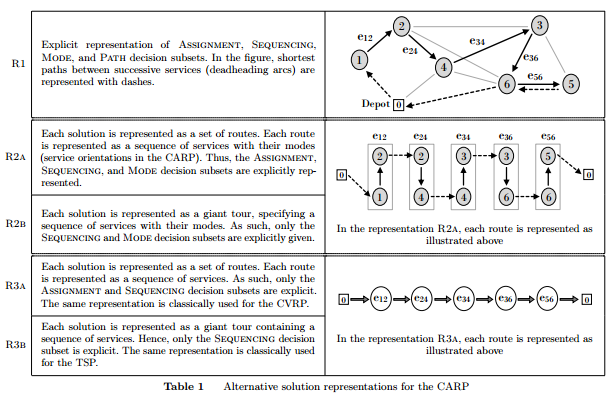

# 2017-Vidal-NEARP

## 文章概况

- 关键技术: 记忆结构, 双向动态规划, 下界估计
- 解决思路: 模式选择的最优化在邻域评价过程通过dp完成
- 突出贡献: 对于带有最优方向选择的一个服务序列(例如ARP的情形)上进行的经典邻域操作, 提出O(1)时间复杂度的评价方法; 将最优方向的选择一般化为一个service的mode的最优选择, 进而将成果应用到Ejection chains和其他两种元启发式搜索中.
- 计算实验: 算法优化适用于CARP, MCGRP, periodic CARP, multi-depot CARP, min-max k-vehicles windy rural postman problem.

## 概念要点:

VRP vs ARP
- node routing中, 最短路决策隐含在距离矩阵计算中, arc routing中, 路径决策会收到服务顺序的影响, 同时也会受到mode选择(如服务方向, 转向限制, 交叉口延误)等的影响
- ARP的计算量大致是VRP的四倍

对ARP的问题求解的建模:
- service: 例如在ARP中, 一个service是节点i和节点j之间的需求(与arc的方向无关)
- mode: 具体的arc方向, 是从i->j还是从j->i, 因此在ARP中, mode的数量为2
- 将ARP求解分为四个步骤, ASSIGNMENT, SEQUENCING, MODE CHOICES, PATH bewteen services
  - Asignment: 决定一个service由哪个route去服务; 
  - Sequence: 决定在一个route中的service的顺序; 
  - Mode: 决定一个service所采用的mode; 
  - Path: 在service k和l的模式确定的前提下, 确定两个service之间的最短路径

提高LS性能的关键:
- 一个邻域操作的评价复杂度压缩到O(1)
- 减少需要搜索的决策数, 缩小搜索空间
- 高效剪枝不可能的邻域变换(用LB代替精确评价), 缩小搜索空间

文章中对应的方案:
- 对当前解的sequence进行预处理计算子序列的成本, 用子序列的concat表示邻域操作, 进而有限次数的concat就可以计算新解成本O(1); 联系Vidal2011a
- 将求解分层后, ASIGNMENT, SEQUENCE前两层用搜索解决, 这时解决的就是VRP问题(只不过计算最短路或成本时, vrp是去查距离矩阵, 这里是用dp计算), 下层用dp做, 因此缩小了决策维度
- 提出了concat时估计下界的方法, 代替精确计算新解成本 [找高效的LB的方法和思想同样适用VRP]

## 具体细节:

### 1. 对ARP问题的建模和表示

- R1: 一个解中显式的包含了ASSIGNMENT, SEQUENCING, MODE CHOICES, PATH bewteen services四个层次的决策子集; 不常用, 需要搜索所有决策的组合
- R2A: R2A的表示方法确定确定了ASSIGNMENT, SEQUENCING, MODE CHOICES, Path通过两个service的具体mode下的endpoint之间的最短路径得到. 需要计算最短路径. 常用, 但是sequence和mode紧耦合, 有些邻域操作需要同时修改这两个决策子集
- R2B: R2B的表示里, 所有service在一个big trip中没有分多个route, 这种表示常用于群算法的crossover操作. 需要O(n^2)的split算法. 不适用于LS阶段. 这类元启发式通常在LS阶段也采用R2A.
- R3: R3A和R3B的区别也是是否需要后续的split操作. R3的表示只包括了ASSIGNMENT, SEQUENCING两部分, 它们将mode的决策用dp子问题解决, 因此保证了这些决策的最优性

### 2. 带最优mode决策的邻域搜索

符号表

|symbol | remark|
|-|-|
|$x \in X$| solution, a set of Routes R(x)|
|$\sigma \in R(x)$| route, $\sigma=(\sigma(1),\sigma(2),\dots,\sigma(\|\sigma\|)$, $\sigma(1) = \sigma(\|\sigma\|) = 0, depot$|
|$s_i^k$|cost of service i in mode $k \in M_i$, $s_0^1=0$ for depot|
|$c_{ij}^{kl}$|cost of travel between service i in k mode and service j in mode l|
|$H_{\sigma}=(V_{\sigma}, A_{\sigma})$|an acyclic auxiliary graph illustrated in follow picture|
|$C(\bar{\sigma})[k,l]$|the cost of the partial shortest path in $H_{\bar{\sigma}}$ between the first and last service in the sequence, for any combination of modes k and l|

上述的辅助无环图: 每个service是在一列, service的每个mode是一个节点, 之间的连线的cost是$c_{ij}^{kl}$

