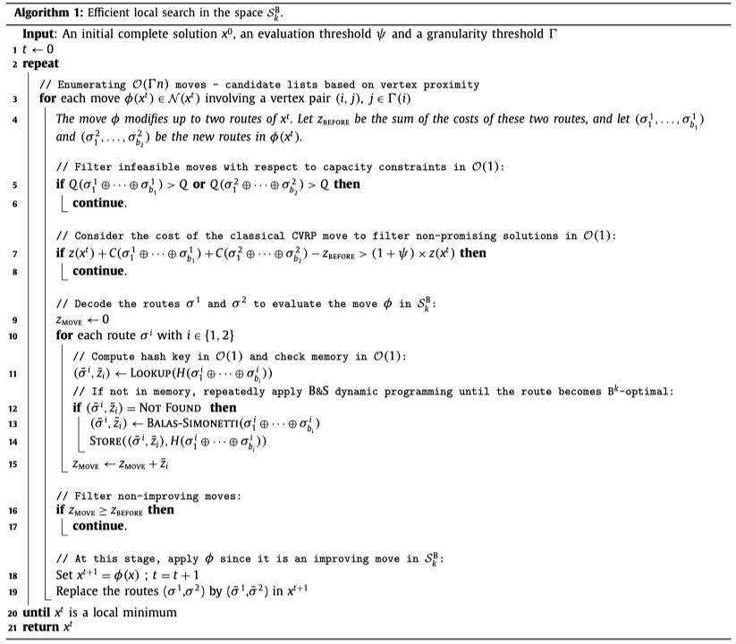
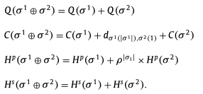
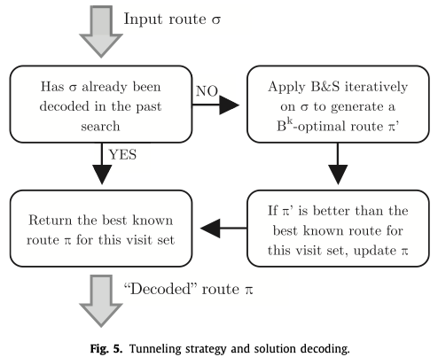
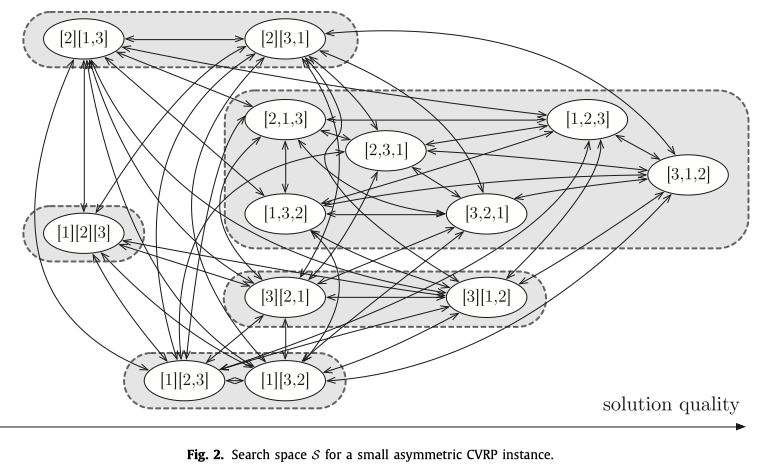
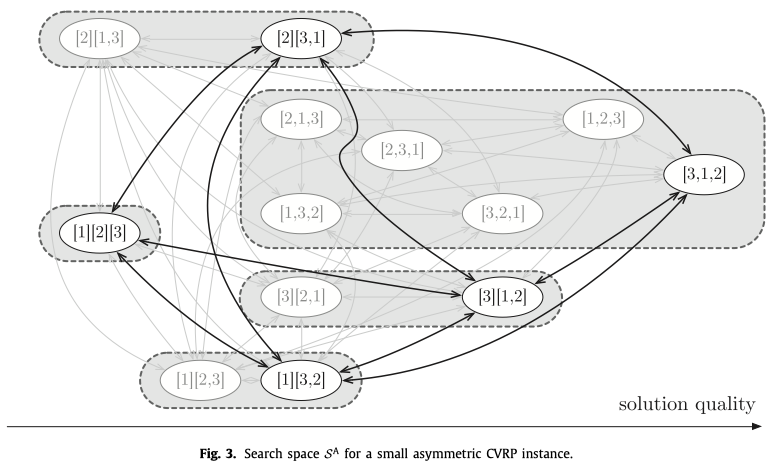
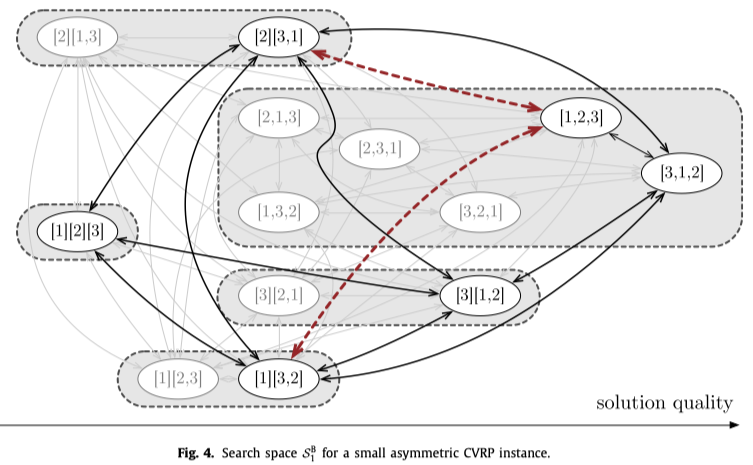

<!--
 * @Author: your name
 * @Date: 2021-01-23 14:38:49
 * @LastEditTime: 2021-01-26 18:17:49
 * @LastEditors: Please set LastEditors
 * @Description: In User Settings Edit
 * @FilePath: /note_md/papers/2019-COR-Toffolo-SeqOrSet.md
-->

# Title

Heuristic for vehicle routing problems: Sequence or set optimization?

## 0. Summary

## 1. Research Objective

## 2. Problem Statement

问题陈述，需要解决的问题是什么？

## 3. Method(s)

### 局部搜索
使用到的技术：static neighborhood reductions, dynamic move filters, efficient memory structure, concation techniques.

目的：限制在$S_k^B$搜索空间中的开销，方便的集成到当前的优秀的元启发式算法中。

#### static neighborhood reduction
- 核心思想是将邻域空间缩小到相关的临近节点上。
- 主要使用的依然是常规的邻域算子来缩小搜索空间，包括作用于单个节点或连续的子串的relocation和swap，2-opt，2-opt*。
- 对于每个节点i只考虑和i节点最近的$\Gamma$个节点j，因此邻域空间的大小被限制到了$O(\Gamma n)$

#### dynamic move filter
- 先说move filter的部分，这个部分是通过一个合适的lower bound对大部分move进行粗略的评估和筛选，只留下高置信的move进行精确的评价。
- 对于容量约束，不进行松弛，如果超过约束直接丢弃
- 对$\phi$动作产生的解进行评价获得的成本$z(\phi(\chi^t))$，作为通过B&S decoder优化后的局部最优解的LB。
- 只有当$z(\phi(\chi^t)) \leq (1+\psi) z(\chi^t)$ 时，猜进行进一步的评价
- $\psi$ 是一个重要参数，表示有多少的move能够被评价。同时，定义一个好的$\psi$并不容易，因为它是一个算例相关的变量，考虑到固定的值无法匹配不同大小的算例和属性，文章采用了一种动态的$\psi$计算方式
- 核心思想是通过调整$\psi$使得通过过滤的move的比例保持在目标范围$[ \xi^-,\xi^+]$
- 具体的方法是每进行1000步move评价，测算filter的通过数量$\xi$，如果调出了目标范围，通过一个超参$\alpha$进行调整：
$$
\psi = \begin{cases}
    \psi \times \alpha & \text{if } \xi \lt \xi^-, \\
    \psi / \alpha & \text{if } \xi \gt \xi^+, \\
    \psi & \text{otherwise.}
\end{cases}
$$

#### global memory
- B&S算法的复杂度按照路径长度线性增长，按照k的取值指数增长。因此这个过程的使用需要被严格限制到最小，避免同一个路径被计算两次。
- 具体的做法是通过一个全局内存存储被解码过的路径，避免重复计算。文章使用一个hashtable记录(伪码12-14行)
- 为避免过高的内存占用，文章同时定义了一个$M^{max}$表示最大的存储到hashtable中的路径数量，当达到这个数量时，去除使用频率较小的一半元素。
- 直接去计算hashtable的key事实上已经是O(n)的复杂度，为控制复杂度，文章设计了特别的hash函数用于计算索引

### 常数时间的评价
- 文章采用的依然是和vidal之前的研究一致的将邻域操作建模成子串重连接。
- 和之前类似，对子串进行预处理，预处理计算子串的总需求$Q(\sigma)$，子串的距离$C(\sigma)$，两个hash函数$H^p(\sigma)$和$H^s(\sigma)$
- 对于只含有一个客户i的子串，$Q(\bar{\sigma})=q_i$，$C(\bar{\sigma})=0$,$H^p(\bar{\sigma})=\rho\times i$, $H^s(\bar{\sigma})=\rho^i$，其中$\rho$是质数。
- 对于更长的子串的计算方法如下：

- 给定的两个哈希函数是为了规避不同的子串哈希碰撞，第一个hash函数是一个乘性hash，第二个是一个加性hash，其中用到的$\rho^i$需要提前计算并对一个大数取模防止溢出。
$$
H^p(\sigma)=\sum_{i=1}^{|\sigma|} \rho^i \times \sigma_i \\
H^s(\sigma)=\sum_{i=1}^{|\sigma|} \rho^{\sigma_i}
$$

- 在值的设计上，第一个$\rho$设置的是超过客户数的最小质数，第二个设置为31

### 隧道策略
- tunneling策略解决的问题是两个不同子串具有相同的客户集合，分别进行BS后得到的成本可能不同（例如一个到了最优解，另一个没有到）的问题
- 具体做法：当一个子串没有被hash存储时，首先会被B&S流程进行解码，但并不直接把B&S的结果返回，而是找到目前这个子串所属的客户集合的B&S最优解进行返回
- 如何高效找到这个子串所属集合的当前最优解：使用一个重新定义的基于hash的内存结构，根据他们的访问集合放置到不同的桶中，使用一个额外的hash函数进行O(1)复杂度的查询，具体流程如下

- tunneling策略的优点：在搜索的开始，算法搜索的是$S^B_k$的空间，随着算法的进行，算法越来越频繁的将当前最优解引入到解中，这部分最优解可能是超出$S_k^B$的，因此在一个理想情况下，B&S返回的总是这个子串的TSP最优解，表现出的就像是算法在$S^A$的解空间进行搜索。因此tunneling技术事实上是随着搜索的进行将$S_k^B$空间重映射到了$S^A$搜索空间当中.

几个搜索空间的比较：

## 4. Evaluation

作者如何评估自己的方法，实验的setup是什么样的，有没有问题或者可以借鉴的地方。

## 5. Conclusion

作者给了哪些结论，哪些是strong conclusions, 哪些又是weak的conclusions?

## 6. Notes

(optional) 不符合此框架，但需要额外记录的笔记。

## Reference

(optional) 列出相关性高的文献，以便之后可以继续track下去。
