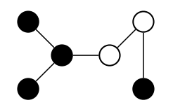
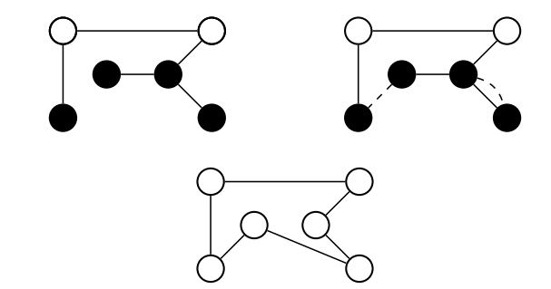
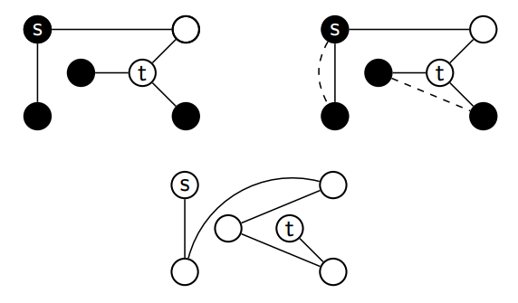
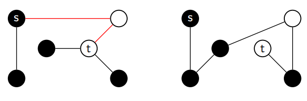
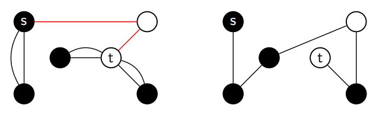
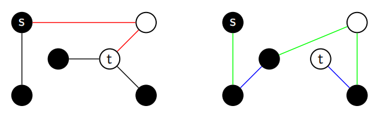
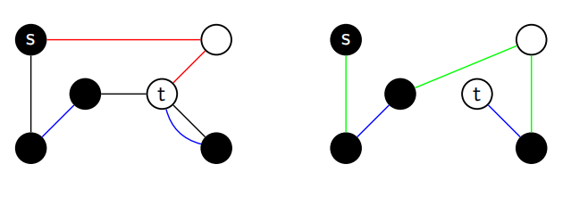
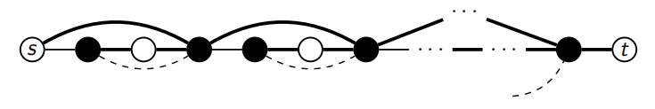
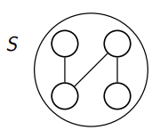
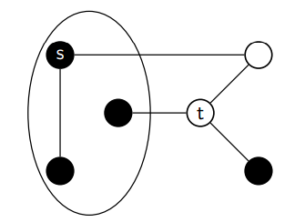

作者| 年份| 近似比
:-:|-|:-:
| Hoogeveen |1991 | $\frac{5}{3}$|
| An, Kleinberg, Shmoys| 2012 | $\frac{1+\sqrt{5}}{2}$|
| Sebo| 2013 | $\frac{8}{5}$|
|Rico Zenklusen|2019 | 1.5|

# Hoogeveen_1991_OR-Letters

Title: **Analysis of Christofides' heuristic: some paths are more difficult than cycles**

Alpha:**5/3**

**TSP定义**

## Christofides' algorithm for TSP

### 基本概念

**T-joins:** 给定点集的子集T, T-join是一个边集, 表示一个子图使得T中的顶点具有奇数度, 不属于T中的顶点具有偶数度.

**shortcut:** 一个shortcut操作是将两个边{i,j},{j,k}收缩成单个边{i,k}.

**ALG1.1**

- 计算G上的最小生成树(MST)F
- T是MST上所有具有奇数度的节点集合, 计算T上的最小成本完美匹配M
- 对F ∪ M构成的欧拉图中上的欧拉回路进行短路得到TSP路径
  

**ALG1.2**

- 计算G上的最小生成树F
- 计算最短odd(T)-join $J \subseteq E$, 其中odd(T)是F上所有度为奇数的节点的集合.
- 对F ∪ J构成的欧拉图中上的欧拉回路进行短路得到TSP路径

**Theorem1:** Christofide's algorithm在TSP上的近似比为1.5

> **proof:**
>
> $c(F) < c(C^*)$, 因为至少比OPT少一条边
> 
> 如果能够证明$c(M)\leq \frac{1}{2}c(C^{\*})$,  则$c(C^{A}) \leq c(F) + C(M) < \frac{3}{2} c(C^{\*})$
> 
> 令1,...,2m为T中的奇数度的点, 并假设它们的序号与在$C^*$中出现的顺序一致, 可以将$C^*$中的边划分为一下两个互斥的子集:E1包括{1,2},{3, 4},...{2m-1, 2m}之间的边, E2包括{2,3}, {4, 5},...{2m, 1}之间的边. 
> 
> 对E1, E2中的边集进行shortcut可以得到M1, M2两个matching. $c(M1) + c(M2) \leq c(E1) + c(E2) = c(C^{\*})$, 【三角不等式关系使等号成立】,因此存在$c(M) \leq \frac{1}{2}c(C^{\*})$

## Hoogeveen’s algorithm for path-TSP

**path TSP定义**

**ALG2.1**

- 令F是G上的MST
- 令T是F中需要被修复的节点的集合:
  - $s$ 当且仅当s在F中具有偶数度
  - $t$ 当且仅当t在F中具有偶数度
  - $v\neq s, t$ 当且仅当v具有奇数度
- 找到T上的最小成本完美匹配M
- 在F ∪ M上找一个欧拉通路
- shortcut通路产生一个s-t hamiltonian path.

用T-join代替完美寻找完美匹配

**ALG2.2**

- 令F是G上的MST
- 令T是F中需要被修复的节点的集合:
  - $s$ 当且仅当s在F中具有偶数度
  - $t$ 当且仅当t在F中具有偶数度
  - $v\neq s, t$ 当且仅当v具有奇数度
- 找到T上的最小成本T-join J
- 在F ∪ J上找一个欧拉通路
- shortcut通路产生一个s-t hamiltonian path.

**Theorem2:** Hoogeveen's algorithm在path TSP上的近似比为5/3

> **proof:**
>
> 令F是MST的边集, $c(F)=\sum_{e \in F} c_e$
> 
> 令O是最优解的边集, OPT = c(O)
> ;
> 有$c(F) \leq OPT$, 因为O也是一个生成树; 令T是F中需要被修复的点的集合
> 
> **思路:** 如果能找到3个T-join使得它们的总成本等于c(F)+OPT, 则有$MST + minimum TJoin \leq c(F) + \frac{1}{3}(c(F) + OPT) \leq OPT + \frac{2}{3}OPT = \frac{5}{3}OPT$
> 
> 令r表示MST中一个s-t通路上的边的集合;
> 
> 对O上的边使用蓝色/绿色交叉上色: 从s开始, 将边变成蓝色遇到第一个T中的点, 接着变换颜色继续上色直到遇到下一个T中的点, 得到两个边集G,B.
> 
> F-R 是一个T-join: F∪(F-R)上除了s-t的每个节点都具有偶数度;
> 
> G是一个T-join: 将T中的节点两两相连;
> 
> B不是一个T-join: F∪B上所有点都具有偶数度, 但是B∪R是一个T-join;
> 
> c(F-R) + c(G) + c(B∪R) = c(F) + c(O);

**Example**

1. 红色边构成R

2. F-R是一个T-join

3. 对OPT上色

4. G和B∪R分别是一个T-join

**一些思考** -- 为什么可以这样构造:
- 一个欧拉图可以短路成一个Hamilton图, 进而拆成两个matching
- matching一定是T-join
- 在F中一定能找到s-t通路
- 通路和opt构成一个可以构成一个hamilton图, 再按照T短路一个构成两个matching
- 最后, 为什么F去掉这个通路也也一定是一个Tjoin? (F-R)∪F相当于除了s-t通路上的边,其他边都复制一条, 不在通路上的点必定有偶数度,在通路上的点,除s-t以外,都是一进一出,具有偶数度, s-t除去通路包含的边, 具有偶数度,加上后具有奇数度.

上述分析是一个紧的界, 因为可以找到如下例子:

图中标出的边的cost均为1, 其他边的cost等于两点之间的最短路径的cost之和, 最优路径是下方路径, 而算法会按照加粗边加上虚线边的方式走, 之比近似5/3.

# AKS_CoRR_2011

Title: **Improving Christofides's Algorithm for the s-t path TSP**

Alpha: **$\frac{1+\sqrt{5}}{2}$**

**Theorem1:** Hoogeveen算法的解不超过$\frac{5}{3}OPT_{LP}$

概念1: Path-TSP的HK松弛

$$
min \sum_{e\in E} c_ex_e\\
\begin{aligned}
    & s.t.\\
    & x(\delta(v))=\begin{cases}
        1, & v=s,t\\
        2, & v\neq s,t
    \end{cases}\\
    & x(\delta(S)) \geq \begin{cases}
        1, & |S \cap \{s,t\}|=1,\\
        2, & |S \cap \{s,t\}|\neq 1,\\
    \end{cases}\\
    & 0 \leq x_e \leq 1, \forall e \in E
\end{aligned}
$$

其中$\delta(S)$是仅有一个端点落在S中的边的边集, 同时$X(E')=\sum_{e \in E'} x_e$, 所谓的松弛就是最后一个0-1向量变成了实数.

概念2: 生成树凸集

生成树凸集由下面的不等式定义:
$$
\begin{aligned}
    & x(E)=|V|-1,\\
    & x(E(S)) \leq |S|-1, \quad \forall |S| \subseteq V, |S| \geq 2,\\
    & x_e \geq 0, \quad \forall e \in E
\end{aligned}
$$

其中E(S)是所有两个端点都在S中的边的边集.

**Lemma:** LP-relaxation的任意可行解x都在生成树凸集中.

> proof: LP-relaxation的约束满足生成树凸集的定义\
> $$
> X(E) \equiv \sum_{e\in E} x_e = \frac{1}{2}\sum_{v\in V}x(\delta(v))\\
> = \frac{1}{2}(|v|-2)\cdot 2 + 2)=|v|-1
> $$
> 同时,
> $$
> X(E(S))=\frac{1}{2}(\sum_{v \in S}x(\delta(v))-x(\delta(S)))
> $$
> 如果$|S\cap \{s,t\}=1$, 有$X(E(S))\leq \frac{1}{2}(1+2(|S|-1)-1)=|S|-1$, 
> 如果$|S\cap \{s,t\}=\empty$, S-1, 
> 如果$|S\cap \{s,t\}=2$,S-2

概念3:奇数集S, 如果$|S\cap T|$含有奇数个, 则S是个奇数集

**Lemma:** S是一个奇数集, 如果$|S\cap \{s,t\}|=1$, 则$|F\cap \delta(S)|$为偶数, 如果$|S\cap \{s,t\}|\neq1$, 则$|F\cap \delta(S)|$为奇数.

例如,

> Proof: s,t 如果在S中, 它们有偶数度, 其他点有奇数度. 
> 定义$\sum_{v\in S}deg_F(v)=2|E(S)\cap F|+|\delta(S)\cap F|$ 
> 证明如下: 
> 1.如果$|S\cap \{s,t\}=1$, 假设$s\in S$, $s\in T$当且仅当$deg_F(s)$even. 
> 则$S_{odd}\rightarrow even$ # 个奇数度的节点在S中($|S\cap T| odd$) 
> $$
> \sum_{v\in S}deg_F(v)-2|E(s)\cap F|=|\delta(s)\cap F|
> $$ 
> 第一个子式为偶数度, 第二个子式肯定是偶数, 则右边也是偶数. 
>  
> 2. 如果$|S\cap \{s,t\}\neq 1$, 
> 则$S_{odd}\rightarrow odd$ # 个奇数度的节点在S中 
> $$
> \sum_{v\in S}deg_F(v)-2|E(s)\cap F|=|\delta(s)\cap F|
> $$
> 第一个子式为奇数度, 第二个子式肯定是偶数, 则右边也是奇数.

概念: T-join LP

以下线性规划的解是一个最小成本的T-join, 对于cost $c\geq 0$:
$$
Min \sum_{e\in E}c_ex_e\\
\begin{aligned}
    & s.t.\\
    & x(\delta(S)) \geq 1, & \forall S \subseteq V, |S\cap T| odd\\
    & x_e \geq 0, & \forall e \in E
\end{aligned}
$$
对于$|S\cap T|$为奇,
$$
\sum_{v\in S}deg_J(v)=2|E(S)\cap J|+|\delta(S)\cap J|
$$

<!-- markdown pdf 打印pdf时渲染latex-->

