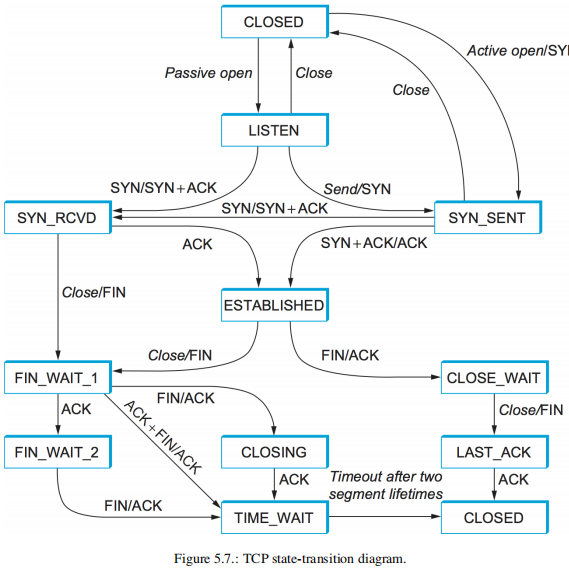

- [基础](#%e5%9f%ba%e7%a1%80)
    - [*** 各层协议的作用，以及 TCP/IP 协议的特点](#%e5%90%84%e5%b1%82%e5%8d%8f%e8%ae%ae%e7%9a%84%e4%bd%9c%e7%94%a8%e4%bb%a5%e5%8f%8a-tcpip-%e5%8d%8f%e8%ae%ae%e7%9a%84%e7%89%b9%e7%82%b9)
    - [*** 理解三次握手以及四次挥手具体过程，三次握手的原因、四次挥手原因](#%e7%90%86%e8%a7%a3%e4%b8%89%e6%ac%a1%e6%8f%a1%e6%89%8b%e4%bb%a5%e5%8f%8a%e5%9b%9b%e6%ac%a1%e6%8c%a5%e6%89%8b%e5%85%b7%e4%bd%93%e8%bf%87%e7%a8%8b%e4%b8%89%e6%ac%a1%e6%8f%a1%e6%89%8b%e7%9a%84%e5%8e%9f%e5%9b%a0%e5%9b%9b%e6%ac%a1%e6%8c%a5%e6%89%8b%e5%8e%9f%e5%9b%a0)
    - [*** UDP与TCP比较，分析上层协议应该使用UDP还是TCP](#udp%e4%b8%8etcp%e6%af%94%e8%be%83%e5%88%86%e6%9e%90%e4%b8%8a%e5%b1%82%e5%8d%8f%e8%ae%ae%e5%ba%94%e8%af%a5%e4%bd%bf%e7%94%a8udp%e8%bf%98%e6%98%aftcp)
    - [*** 可靠传输原理，并设计可靠UDP协议](#%e5%8f%af%e9%9d%a0%e4%bc%a0%e8%be%93%e5%8e%9f%e7%90%86%e5%b9%b6%e8%ae%be%e8%ae%a1%e5%8f%af%e9%9d%a0udp%e5%8d%8f%e8%ae%ae)
    - [*** TCP 拥塞控制的作用，理解具体原理](#tcp-%e6%8b%a5%e5%a1%9e%e6%8e%a7%e5%88%b6%e7%9a%84%e4%bd%9c%e7%94%a8%e7%90%86%e8%a7%a3%e5%85%b7%e4%bd%93%e5%8e%9f%e7%90%86)
- [HTTP](#http)
    - [*** GET 与 POST 比较：作用、参数、安全性、幂等性、可缓存](#get-%e4%b8%8e-post-%e6%af%94%e8%be%83%e4%bd%9c%e7%94%a8%e5%8f%82%e6%95%b0%e5%ae%89%e5%85%a8%e6%80%a7%e5%b9%82%e7%ad%89%e6%80%a7%e5%8f%af%e7%bc%93%e5%ad%98)
    - [*** Cookie 作用、安全性问题、和 Session 的比较](#cookie-%e4%bd%9c%e7%94%a8%e5%ae%89%e5%85%a8%e6%80%a7%e9%97%ae%e9%a2%98%e5%92%8c-session-%e7%9a%84%e6%af%94%e8%be%83)
    - [*** 长连接与短连接原理以及使用场景，流水线](#%e9%95%bf%e8%bf%9e%e6%8e%a5%e4%b8%8e%e7%9f%ad%e8%bf%9e%e6%8e%a5%e5%8e%9f%e7%90%86%e4%bb%a5%e5%8f%8a%e4%bd%bf%e7%94%a8%e5%9c%ba%e6%99%af%e6%b5%81%e6%b0%b4%e7%ba%bf)
    - [*** HTTP 存在的安全性问题，以及 HTTPs 的加密、认证和完整性保护作用](#http-%e5%ad%98%e5%9c%a8%e7%9a%84%e5%ae%89%e5%85%a8%e6%80%a7%e9%97%ae%e9%a2%98%e4%bb%a5%e5%8f%8a-https-%e7%9a%84%e5%8a%a0%e5%af%86%e8%ae%a4%e8%af%81%e5%92%8c%e5%ae%8c%e6%95%b4%e6%80%a7%e4%bf%9d%e6%8a%a4%e4%bd%9c%e7%94%a8)
    - [** HTTP/1.1, HTTP/2的特性](#http11-http2%e7%9a%84%e7%89%b9%e6%80%a7)
    - [** Restful API](#restful-api)
- [socket](#socket)
    - [*** select、poll、epoll 的原理、比较、以及使用场景；epoll 的水平触发与边缘触发](#selectpollepoll-%e7%9a%84%e5%8e%9f%e7%90%86%e6%af%94%e8%be%83%e4%bb%a5%e5%8f%8a%e4%bd%bf%e7%94%a8%e5%9c%ba%e6%99%afepoll-%e7%9a%84%e6%b0%b4%e5%b9%b3%e8%a7%a6%e5%8f%91%e4%b8%8e%e8%be%b9%e7%bc%98%e8%a7%a6%e5%8f%91)

# 基础

### *** 各层协议的作用，以及 TCP/IP 协议的特点

  IP/TCP五层协议
  - 物理层: 电信号的传输
  - 链路层: 直接连接的两台主机之间的传输, 使用CRC差错检测
  - 网络层: 网络中两个主机之间的传输
  - 运输层: 两个端口之间的连接, 校验和包括首部+数据+伪首部三部分,tcp和udp都有校验和
  - 应用层: 两个进程之间的连接

  为什么运输层用校验和进行差错检测而链路层用CRC?
  - 主要因为运输层通常在用户主机中作为操作系统的一部分实现，所以使用相对简单和快速的校验和，而链路层差错检测在适配器中用专业硬件实现，能够快速处理复杂多CRC操作

### *** 理解三次握手以及四次挥手具体过程，三次握手的原因、四次挥手原因
**三次握手**
- TCP是双工的有连接的协议, 三次握手的目的是确认双方的发送接受数据的能力, 建立连接. 
- 三次握手过程, 客户端发送syn, 服务端接收到后返回ack+syn, 客户端接收到后对syn进行应答ack. 服务端收到, 连接建立.
- 服务端收到第一个syn时,确认了客户端的发送能力和自身的接收能力.
- 客户端收到ack+syn时, 确认了服务器的发送能力,接收能力和自身的发送能力和接收能力.
- 服务端收到ack时, 确认了自身的发送能力和客户端的接收能力.
- 此时双方都准备好的发送和接收数据, 连接可以建立.

**四次挥手**
- 四次挥手是TCP断开连接的过程, 因为是双工协议, 所以双向的链路需要分别拆除
- 具体过程, 首先发起结束连接的a端没有数据要发送, 则向b端发送fin, 自身进入FIN_WAIT_1; b端接收到a端关闭a->b的连接, 返回ack,自身进入CLOSE_WAIT. a端收到ack, 进入FIN_WAIT_2; b端发送完所有数据, 向a端发送fin, 自身进入LAST_ACK; a端收到后返回ack, 进入TIME_WAIT; b端收到ack进入CLOSED, a端进入过两个tcp段的超时时间MSL, 转入CLOSED.

**常见问题**
- 为什么要有TIME_WAIT状态? 
  - TIME_WAIT状态是用来重发可能丢失的ACK报文。在Client发送出最后的ACK回复，但该ACK可能丢失。Server如果没有收到ACK，将不断重复发送FIN片段。所以Client不能立即关闭，它必须确认Server接收到了该ACK
- 为什么连接的时候是三次握手，关闭的时候却是四次握手? 
  - 如果双方都恰好没有数据发了,的确可以三次就结束, 但是可能存在一个方向的连接关闭, 另一个方向数据还没发完的情况. 因此需要分别断开该方向的连接.
- 为什么要三次握手? 
  - 两次握手可能产生死锁. c向s发送syn, s回复ack, 建立连接并发送数据. c在等待ack, s重复发送数据.
- 如果已经建立了连接，但是客户端突然出现故障了怎么办? 
  - tcp的保活计时器, 如果两小时无反应发送探测报文, 10次后关闭连接.

### *** UDP与TCP比较，分析上层协议应该使用UDP还是TCP
- UDP只在IP层上简单实现了端口到端口的通信, 无状态无连接的不可靠协议; TCP实现了面向连接的可靠传输协议;
- UDP的数据模型是数据报模型, TCP的数据模型是流模型. 因此UDP的报文之间有明确的边界. 而TCP可能会发生粘包的问题.
- UDP不需要建立和断开连接, 服务器不保留状态和资源, 更加不容易被攻击, 吞吐量更大; 但是数据可能丢失, 可能失序.
- TCP维护了连接, 能够保证数据的有序,可靠传输.为了达到上述功能, TCP设计了可靠传输, 拥塞控制, 有序到达等机制.
- UDP适合没有连续通信需求的情况, 例如主机向DNS, DHCP. TCP适合有连续数据需要传输的场景, 如FTP等.

### *** 可靠传输原理，并设计可靠UDP协议

- 可靠传输的原理: 序列号 确认应答 超时重传 拥塞控制
- 序列号: 保证数据有序性.根据序号可以丢弃重复数据段
- 确认应答: 收到数据返回ack.
- 没有收到ack会进行重传.
- 拥塞控制: 慢启动, 拥塞避免, 快速重传, 快速恢复.

设计可靠UDP //todo
### *** TCP 拥塞控制的作用，理解具体原理
- 拥塞控制: 慢启动, 拥塞避免, 快速重传, 快速恢复.
- 慢启动: 窗口从1开始指数增长(慢是相比把整个数据一起传)
- 拥塞避免: 当慢启动到达慢启动阈值(ssthresh)时, 从窗口每个RTT增长1倍改为每个RTT增长1
- 快速重传: 没有快速重传时, 只有一个TCP报文段没有收到ack超时才触发重传. 而快速重传指收到三个重复ack(有丢包或乱序到达)时触发重传.
- 快速恢复: 没有快速恢复时, 遇到超时或重复ack时, 拥塞窗口设为1, 重新开始慢启动. 快速恢复机制是遇到快速重传时, 将cw设为一半.进入拥塞避免.

# HTTP

### *** GET 与 POST 比较：作用、参数、安全性、幂等性、可缓存
- get方法的参数在url中, post方法的参数在请求数据中. get方法通常用于查询等没有数据修改发生的情形, post方法通常用于删改
- 安全性: post比get安全,get中的参数数据显示在URL中,能够被浏览器保留, 能够被所有人看到
- 幂等性: get方法没有副作用是幂等的, 后退刷新是无害的, 只应当用于取回数据
- 数据长度和类型: get方法的数据类型只能是ASCII字符, 长度受url长度限制不超过2048, post方法没有限制, 可以添加二进制数据
- 可缓存:get方法能够被cdn缓存, post方法不能被缓存, 只能被服务器处理
### *** Cookie 作用、安全性问题、和 Session 的比较
- session 在服务器端，cookie 在客户端（浏览器）,因此cookie不能存储密码之类的私密信息
- session 默认被存在在服务器的一个文件里（不是内存）
- session 的运行依赖 session id，而 session id 是存在 cookie 中的，也就是说，如果浏览器禁用了 cookie ，同时 session 也会失效（但是可以通过其它方式实现，比如在 url 中传递 session_id）
- session 可以放在 文件、数据库、或内存中都可以。
- 用户验证这种场合一般会用 session

### *** 长连接与短连接原理以及使用场景，流水线
- 短连接: 每一个HTTP请求都要求TCP socket 建立连接拆除连接; 长连接, 完成一个HTTP请求时, socket不close, 当下一次HTTP请求时, 还可以使用该连接
- 短连接优点: 连接管理简单, 都是有用的连接;长连接就存在客户端离开但是服务器端依然维持了一个半开放的连接占用资源的情况. 解决方案, 两小时无活动发送探测报文
- 数据库的连接用长连接,操作频繁，点对点的通讯，而且连接数不能太多情况;
- WEB网站的http服务一般都用短链接，因为长连接对于服务端来说会耗费一定的资源

### *** HTTP 存在的安全性问题，以及 HTTPs 的加密、认证和完整性保护作用
- 存在的问题: 劫持, 中间人攻击
- 用http访问https的网站会发生什么? 302重定向
- HTTPS和HTTP差别
  - 在http和tcp之间增加了TLS层进行加密, 采用混合加密, A和B通信, A用B的公钥加密对称加密的密钥,发给B, B用私钥解密, 得到密钥, 双方用密钥进行对称加密传输
  - 以上存在的问题, 中间人攻击: A得到的是中间人的公钥, 则中间人可以解密得到密钥, 然后用B的公钥加密, 发给B.
  - CA: 如何安全的发布公钥: 将B的信息和公钥进行hash并用CA的私钥加密得到数组签名, 将B的信息和公钥和数字签名一并作为数字证书. A得到数字证书用CA的公钥解密签名得到摘要, 对数字证书的中的公钥和信息进行hash得到摘要进行比对.

### ** HTTP/1.1, HTTP/2的特性
- HTTP/1.1特性: 持久连接(长连接)、分块传输编码, 节约带宽、HOST域、管道机制
  - 持久连接: Connection:keep-alive, 可以复用TCP连接
  - 分块传输编码: 断点重传, 客户端申请资源时引入range头, 请求部分资源, 返回206
  - 管道机制: 若干个请求排队串行化单线程处理，后面的请求等待前面请求的返回才能获得执行机会，一旦有某请求超时等，后续请求只能被阻塞
- HTTP/2 特性: 多路复用、服务器推送、头信息压缩、二进制协议等
  - 多路复用,多个请求可同时在一个连接上并行执行。某个请求任务耗时严重，不会影响到其它连接的正常执行,像tcp的窗口传输

### ** Restful API
- 每一个URI代表一种资源；
- 客户端和服务器之间，传递这种资源的某种表现层；
- 客户端通过四个HTTP动词，对服务器端资源进行操作，实现"表现层状态转化"

# socket

### *** select、poll、epoll 的原理、比较、以及使用场景；epoll 的水平触发与边缘触发

